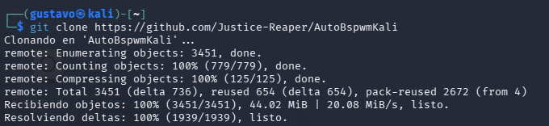
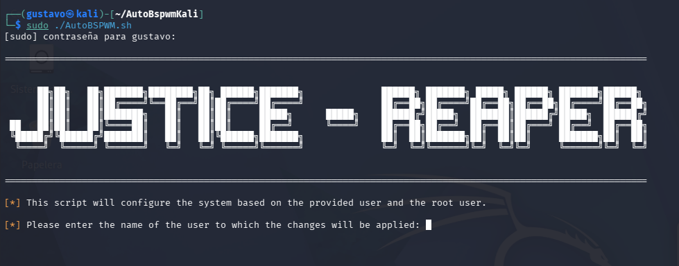

# 🛠️ Transformación de Entorno en Kali Linux: AutoBspwmKali

Este laboratorio documenta el proceso de despliegue de un entorno profesional de pentesting utilizando **BSPWM** (Binary Space Partitioning Window Manager).

El objetivo es migrar de un entorno de escritorio tradicional (XFCE/Gnome) a un entorno de ventanas tipo *tiling* optimizado para la productividad, bajo consumo de recursos y agilidad en auditorías de ciberseguridad.

Utilizaremos la herramienta automatizada: [AutoBspwmKali](https://github.com/Justice-Reaper/AutoBspwmKali).

---

## 1. Estado Inicial (The "Before")

Partimos de una instalación estándar de Kali Linux. Como se observa, el entorno de escritorio por defecto consume más recursos gráficos y la gestión de ventanas es manual.

**Especificaciones del sistema actual:**


*Captura de pantalla mostrando el entorno XFCE por defecto y las especificaciones del sistema (Fastfetch).*

---

## 2. Instalación y Despliegue

El proceso se realiza clonando el repositorio oficial de la herramienta y ejecutando el script de orquestación.

### Paso 2.1: Actualización del Sistema
Antes de comenzar, aseguramos que el sistema y las dependencias base estén actualizadas para evitar conflictos durante la compilación de herramientas.

```bash
sudo apt update && sudo apt upgrade -y
```

---

Paso 2.2: Clonación del Repositorio
Descargamos el código fuente de AutoBspwmKali en nuestro directorio de trabajo.

```bash
git clone https://github.com/Justice-Reaper/AutoBspwmKali
```


Paso 2.3: Ejecución del Instalador
Accedemos al directorio descargado, otorgamos permisos de ejecución al script principal (AutoBSPWM.sh) y lo ejecutamos con privilegios de superusuario.

```bash
cd AutoBspwmKali
chmod +x AutoBSPWM.sh
sudo ./AutoBSPWM.sh
```

⚠️ Nota de ejecución: Durante el proceso, el script detectará el entorno y nos pedirá confirmación sobre si estamos instalando en una Máquina Virtual o en Hardware Físico. Selecciona la opción adecuada para tu caso.

---
Paso 2.4: Definición de Usuario
Una vez iniciado el script, veremos el banner de bienvenida. El sistema nos solicitará el nombre del usuario al que se aplicarán los cambios (en nuestro caso, el usuario gustavo).

Introducimos nuestro nombre de usuario para que el script configure los permisos y directorios en /home/usuario.


*Introducimos nuestro nombre de usuario para que el script configure los permisos y directorios en `/home/usuario`.*

---
Paso 2.5: Configuración de Shell y Optimización VM
Durante esta fase, el script instala Powerlevel10k para la terminal y nos preguntará si estamos ejecutando Kali Linux en una máquina virtual. Es crítico responder correctamente para que se apliquen las configuraciones gráficas adecuadas (Picom) y evitar lag en la interfaz.

Seleccionamos "YES" para desactivar efectos pesados de blur y transparencias que no rinden bien en virtualización.


*Seleccionamos "YES" para desactivar efectos pesados de blur y transparencias que no rinden bien en virtualización.*

---

3. Inventario de Software Instalado
El instalador permite añadir herramientas adicionales esenciales para el flujo de trabajo de seguridad:

✅ Herramientas Añadidas:
Obsidian: Gestión de notas y documentación de auditorías.

Visual Studio Code: Editor de código integrado con repositorios oficiales de Microsoft.

Postman: Herramienta para pruebas y auditoría de APIs.

NVIM (Neovim): Configurado con NVChad para edición rápida en terminal.

Caido: Instalado y configurado como proxy predeterminado para análisis web.

PyCharm Community: Entorno para desarrollo avanzado en Python.

Herramientas de Pentesting: Instalación de Bloodhound, Neo4j, PayloadsAllTheThings, Pwntools y SecLists.

❌ Herramientas Omitidas:
Burp Suite Professional: Se descartó para mantener la versión Community estándar y evitar conflictos externos.

Navegador Predeterminado: Se mantuvo Firefox como principal, rechazando poner Google Chrome o Tor como predeterminados por rendimiento.

4. Finalización y Resultado
Tras completar la instalación de herramientas y limpiar archivos temporales, el script confirma que el entorno BSPWM ha sido instalado exitosamente.

El sistema recomienda reiniciar para cargar correctamente la nueva configuración.

Paso 4.1: Selección de Sesión
Al reiniciar, es necesario seleccionar manualmente la sesión de bspwm en el gestor de inicio (LightDM).

Activación del nuevo gestor de ventanas tiling.

Paso 4.2: Entorno Operativo
El escritorio final presenta una estética limpia, funcional y con una Polybar informativa que facilita el control durante las pruebas de penetración.

Vista final del escritorio BSPWM configurado y listo para su uso.
