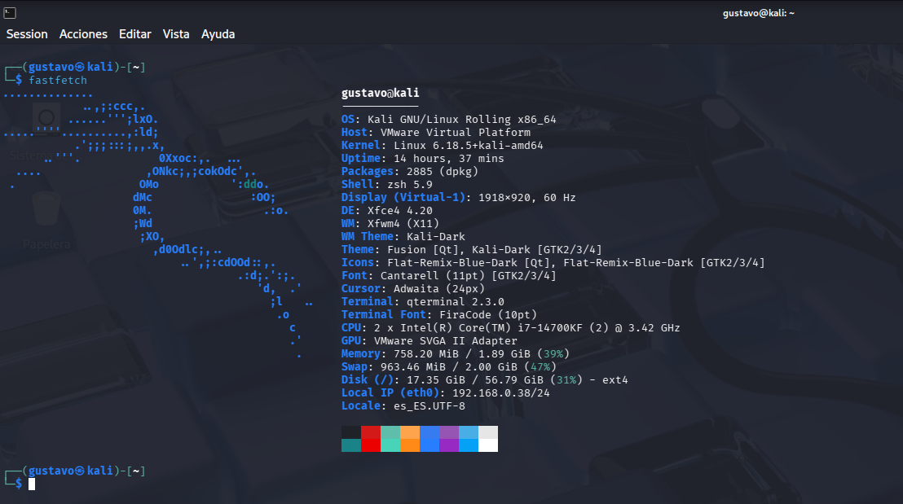
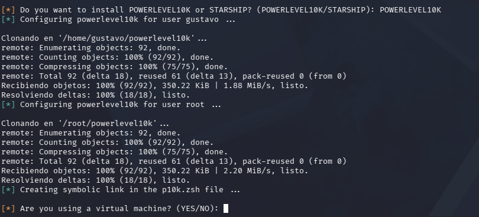
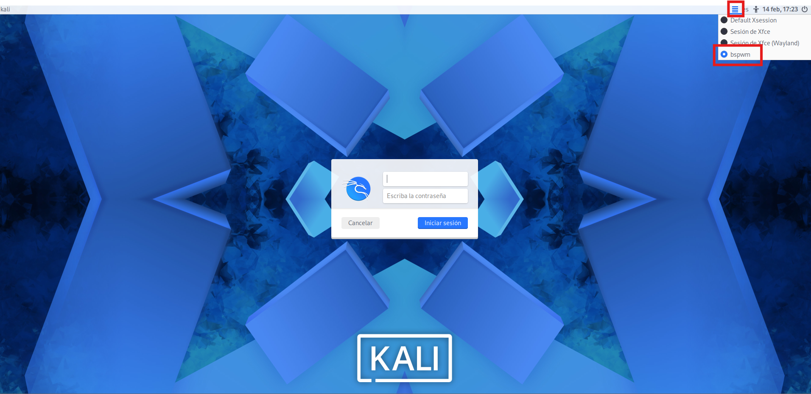
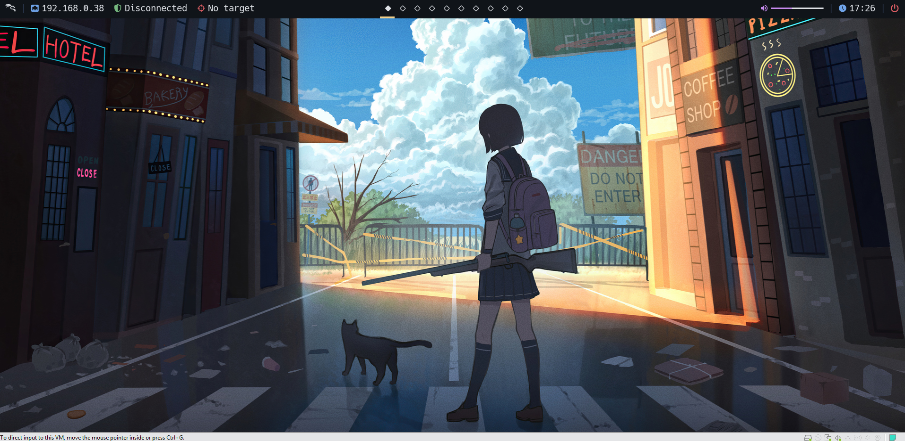
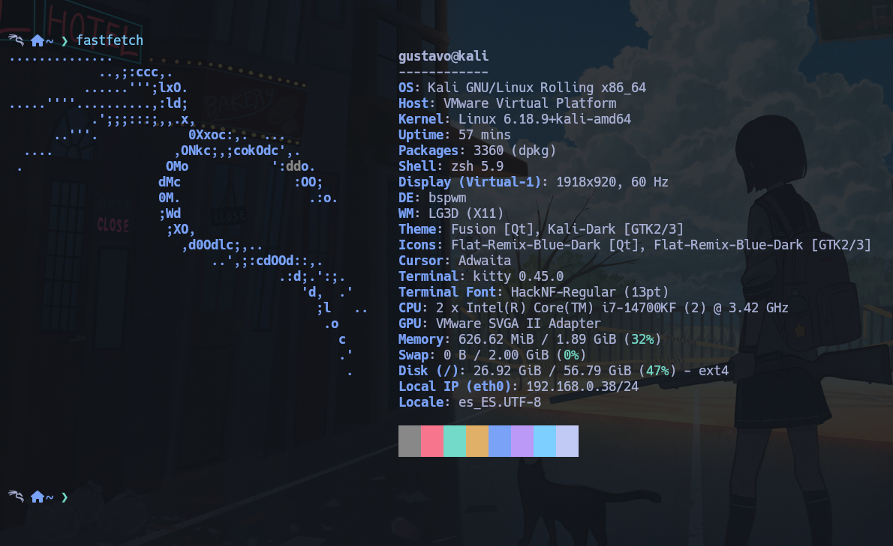

# 🛠️ Transformación de Entorno en Kali Linux: AutoBspwmKali

Este laboratorio documenta el proceso de despliegue de un entorno profesional de pentesting utilizando **BSPWM** (Binary Space Partitioning Window Manager).

El objetivo es migrar de un entorno de escritorio tradicional (XFCE/Gnome) a un entorno de ventanas tipo *tiling* optimizado para la productividad, bajo consumo de recursos y agilidad en auditorías de ciberseguridad.

Utilizaremos la herramienta automatizada: [AutoBspwmKali](https://github.com/Justice-Reaper/AutoBspwmKali).

---

## 1. Estado Inicial (The "Before")

Partimos de una instalación estándar de Kali Linux. Como se observa, el entorno de escritorio por defecto consume más recursos gráficos y la gestión de ventanas es manual.

**Especificaciones del sistema actual:**


*Captura de pantalla mostrando el entorno XFCE por defecto y las especificaciones del sistema (Fastfetch).*

---

## 2. Instalación y Despliegue

El proceso se realiza clonando el repositorio oficial de la herramienta y ejecutando el script de orquestación.

### Paso 2.1: Actualización del Sistema
Antes de comenzar, aseguramos que el sistema y las dependencias base estén actualizadas para evitar conflictos durante la compilación de herramientas.

```bash
sudo apt update && sudo apt upgrade -y
```

---

Paso 2.2: Clonación del Repositorio
Descargamos el código fuente de AutoBspwmKali en nuestro directorio de trabajo.

```bash
git clone https://github.com/Justice-Reaper/AutoBspwmKali
```


Paso 2.3: Ejecución del Instalador
Accedemos al directorio descargado, otorgamos permisos de ejecución al script principal (AutoBSPWM.sh) y lo ejecutamos con privilegios de superusuario.

```bash
cd AutoBspwmKali
chmod +x AutoBSPWM.sh
sudo ./AutoBSPWM.sh
```

⚠️ Nota de ejecución: Durante el proceso, el script detectará el entorno y nos pedirá confirmación sobre si estamos instalando en una Máquina Virtual o en Hardware Físico. Selecciona la opción adecuada para tu caso.

---
Paso 2.4: Definición de Usuario
Una vez iniciado el script, veremos el banner de bienvenida. El sistema nos solicitará el nombre del usuario al que se aplicarán los cambios (en nuestro caso, el usuario gustavo).

Introducimos nuestro nombre de usuario para que el script configure los permisos y directorios en /home/usuario.


*Introducimos nuestro nombre de usuario para que el script configure los permisos y directorios en `/home/usuario`.*

---
Paso 2.5: Configuración de Shell y Optimización VM
Durante esta fase, el script instala Powerlevel10k para la terminal y nos preguntará si estamos ejecutando Kali Linux en una máquina virtual. Es crítico responder correctamente para que se apliquen las configuraciones gráficas adecuadas (Picom) y evitar lag en la interfaz.


*Seleccionamos "YES" para desactivar efectos pesados de blur y transparencias que no rinden bien en virtualización.*

---

## 3. Inventario de Software Instalado

Durante la ejecución, el instalador nos permite personalizar el arsenal de herramientas adicionales. Basándonos en las necesidades de un laboratorio de pentesting moderno, estas fueron las decisiones tomadas:

### ✅ Herramientas Añadidas:
* **Gestión de Notas:** **Obsidian**, instalada para centralizar la documentación de auditorías y *writeups* en formato Markdown.
* **Desarrollo y Edición:** * **Visual Studio Code:** Integrado mediante sus repositorios oficiales para asegurar actualizaciones automáticas.
    * **PyCharm Community:** Entorno dedicado para el desarrollo y depuración de scripts avanzados en Python.
    * **NVIM (Neovim):** Configurado con el framework **NvChad** para disponer de un editor de terminal rápido y estético.
* **Auditoría Web y APIs:** * **Caido:** Instalado y configurado como el **proxy predeterminado** del sistema debido a su ligereza frente a Burp Suite.
    * **Postman:** Herramienta esencial para la interceptación y pruebas de peticiones en APIs.
* **Arsenal de Pentesting (Herramientas Pro):** Se incluyó la descarga e instalación automatizada de paquetes críticos:
    * **SecLists:** Diccionarios masivos para ataques de fuerza bruta.
    * **Bloodhound & Neo4j:** Herramientas para el análisis de rutas de ataque en Active Directory.
    * **PayloadsAllTheThings:** Repositorio de consulta para vectores de ataque y exploits.
    * **Pwntools:** Framework de Python para el desarrollo de exploits y resolución de CTFs.

### ❌ Herramientas Omitidas:
* **Burp Suite Professional:** Se rechazó su instalación para evitar el uso de cargadores externos o problemas de licencias, manteniendo la versión *Community* preinstalada en Kali.
* **Navegadores:** Se mantuvo **Firefox** como navegador principal del sistema. Se declinó establecer Google Chrome o Tor como navegadores predeterminados para optimizar el consumo de recursos de la Máquina Virtual.

---

## 4. Finalización y Resultado

Tras completar la instalación de todas las herramientas y realizar la limpieza de paquetes temporales, el script confirma que el entorno BSPWM ha sido desplegado exitosamente.

### Paso 4.1: Instalación Exitosa
El mensaje final del instalador nos indica que el proceso ha terminado y recomienda un reinicio para que todos los cambios de configuración se carguen correctamente.

 

 *Confirmación del despliegue exitoso del entorno BSPWM.*

### Paso 4.2: Selección de Sesión
Al reiniciar el sistema, accedemos al menú de sesiones del gestor de inicio (LightDM) para seleccionar manualmente la entrada de **bspwm** antes de introducir las credenciales.


*Activación del nuevo gestor de ventanas tiling desde la pantalla de login.*

### Paso 4.3: Entorno Operativo Final
El resultado es un escritorio estético y funcional, con una barra superior (Polybar) que centraliza la información del sistema y un fondo de pantalla personalizado que completa la identidad del laboratorio.


*Vista general del entorno operativo tras la personalización completa.*

### Paso 4.4: El "Después" (The "After")
Para cerrar el ciclo, comparamos las especificaciones finales del sistema. Ahora bajo el entorno **BSPWM**, observamos un sistema optimizado y listo para la acción.


*Especificaciones finales del sistema mostrando el cambio de entorno a bspwm.*

---

## 🌟 Integración Destacada: KaliOptimus

Una de las grandes novedades en la actualización de este entorno es la inclusión nativa de **KaliOptimus**, una herramienta desarrollada por mí para la optimización y mantenimiento del sistema.

Como se puede observar en la ayuda del sistema, el comando `kaliOptimus` ahora forma parte del arsenal de utilidades integradas en el flujo de trabajo de ZSH.

### ¿Qué hace KaliOptimus en este entorno?
* **Mantenimiento Automatizado:** Repara repositorios corruptos y actualiza las llaves GPG de forma automática.
* **Optimización de Paquetes:** Realiza limpiezas profundas de dependencias obsoletas para mantener el sistema ligero.
* **Actualización Inteligente:** Ejecuta un `full-upgrade` gestionando posibles conflictos de paquetes típicos de Kali Linux.

Es un orgullo ver cómo herramientas de nuestra propia cosecha se integran en proyectos tan potentes como AutoBspwmKali para ayudar a toda la comunidad.

---
---

## ⌨️ Comandos Personalizados y Mantenimiento

El entorno incorpora una serie de funciones en ZSH diseñadas para optimizar el flujo de trabajo y el mantenimiento del sistema.

### 🌟 Integración Destacada: KaliOptimus (v2.0)
Como parte fundamental de la actualización del sistema, se ha integrado de forma nativa mi herramienta **KaliOptimizer & Repair**, accesible mediante el comando `kaliOptimus`.

Esta utilidad automatiza procesos críticos de salud del sistema:
* **Restauración de Repositorios:** Sobrescribe el `sources.list` con las fuentes oficiales de Kali Linux.
* **Gestión de Llaves GPG:** Purga llaves corruptas y descarga las firmas más recientes automáticamente.
* **Actualización Inteligente:** Ejecuta un `Full Upgrade` del sistema asegurando la integridad de los paquetes.


*KaliOptimizer & Repair v2.0 en plena ejecución durante el mantenimiento del sistema.*

### 🛠️ Utilidades de Gestión y Pentesting
Además, el sistema cuenta con los siguientes alias personalizados:

* **Gestión de Objetivos:** `setTarget` y `clearTarget` para visualizar la IP de la víctima en la Polybar.
* **Análisis de Red:** `extractPorts` para copiar rápidamente puertos abiertos desde ficheros de Nmap al portapapeles.
* **Productividad:**
    * `mkt`: Crea una estructura de directorios de trabajo organizada.
    * `xcopy`: Copia el contenido de archivos directamente al portapapeles.
    * `showHelpPanel`: Despliega visualmente todos los atajos y comandos disponibles.
