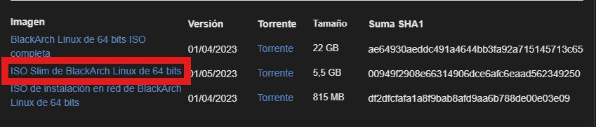
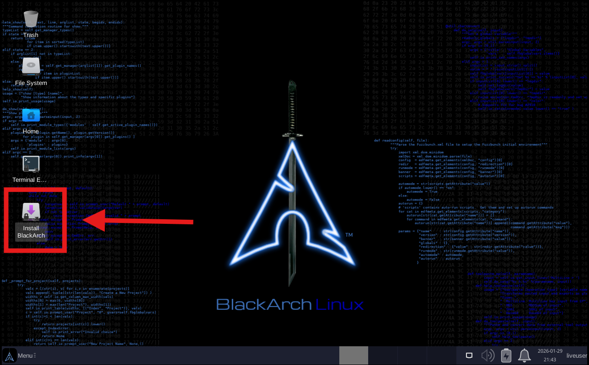
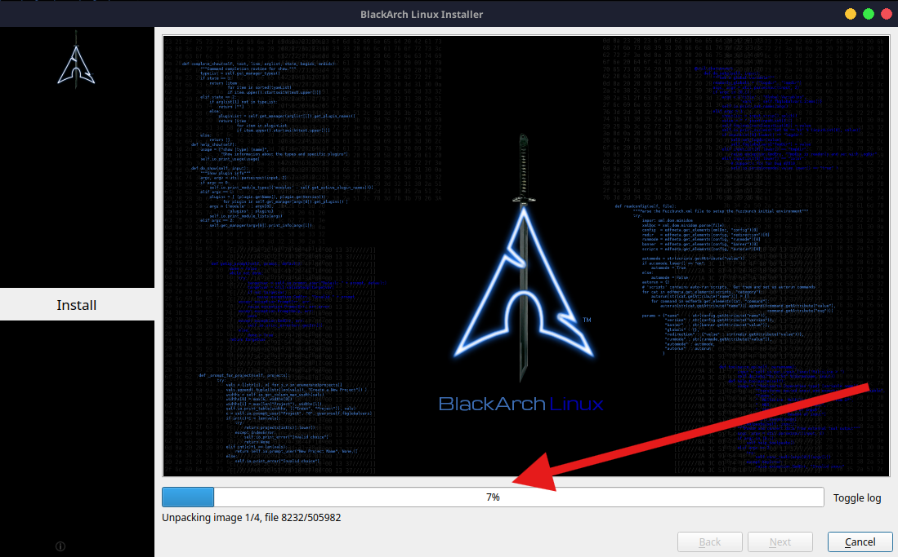
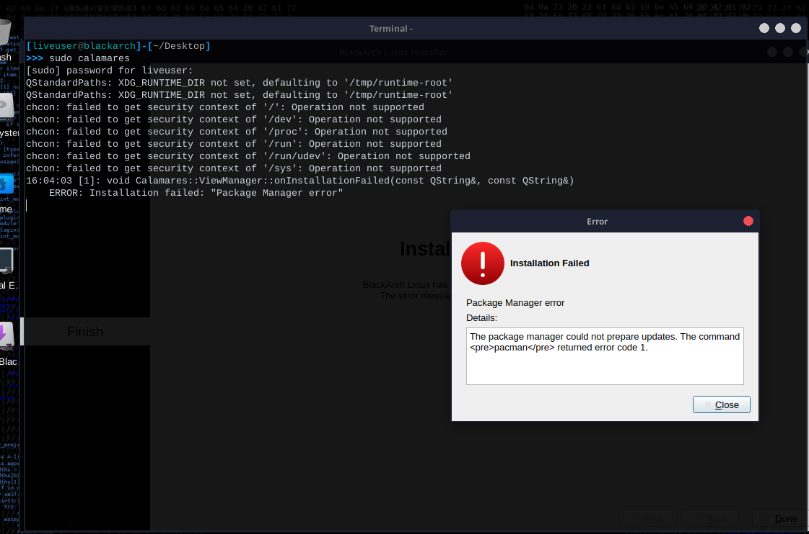
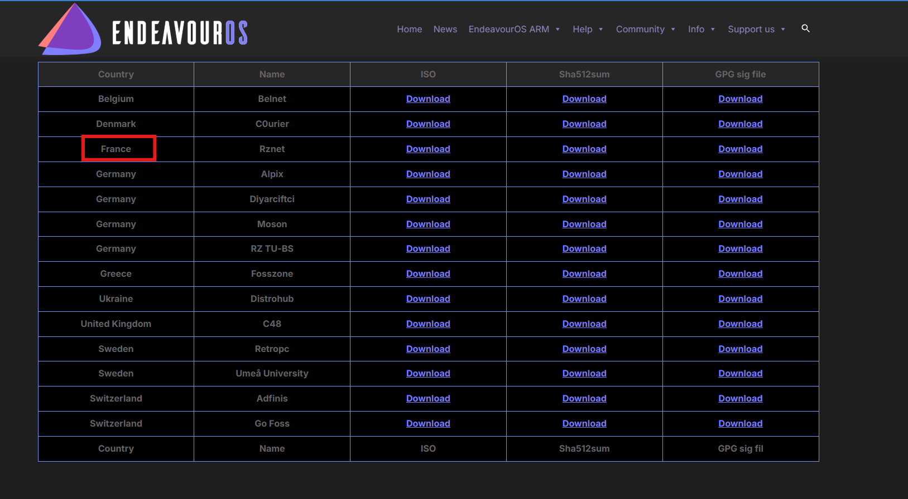
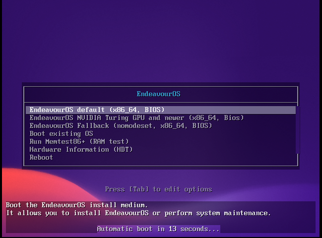
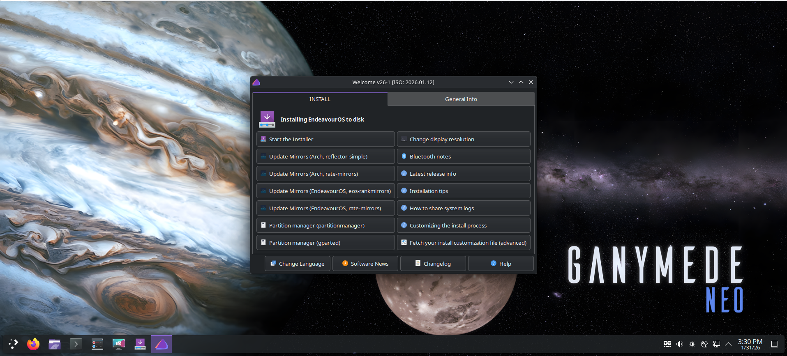
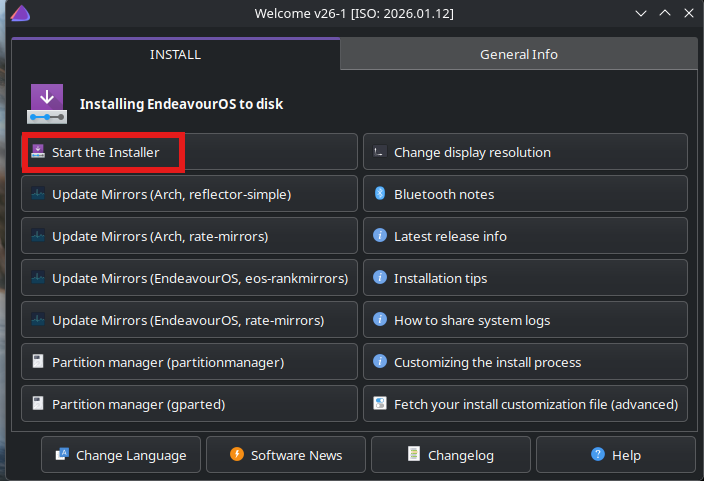
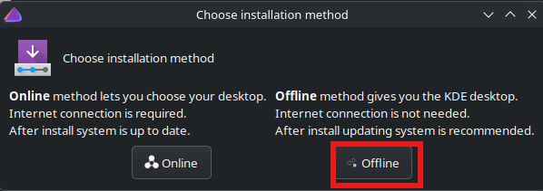
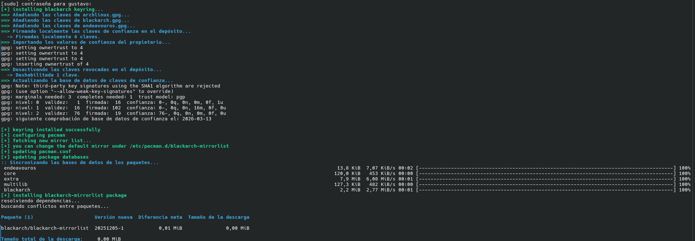

# 🛡️ Lab Deployment: BlackArch Linux — *The Smart Way* (via EndeavourOS)

> **⚠️ DISCLAIMER / AVISO LEGAL:**
> Este repositorio y su documentación han sido creados **exclusivamente con fines educativos y de investigación en Ciberseguridad**.  
> El autor no se hace responsable del uso indebido de las herramientas aquí descritas. El acceso a sistemas informáticos sin autorización es ilegal.
> *"Knowledge is power, but power requires responsibility."*

---

## 🎯 Objetivo del Proyecto

El propósito de este laboratorio es desplegar un **entorno de Pentesting robusto, estable y actualizado**, integrando el arsenal completo del **repositorio oficial de BlackArch Linux (+2800 herramientas)** sobre una base sólida de **EndeavourOS (Arch Linux)**.

Este proyecto documenta:
1.  El **fallo crítico** al intentar instalar la ISO oficial *Legacy* de BlackArch.
2.  El **troubleshooting real** del error de keyring/GPG.
3.  La **solución definitiva** mediante una arquitectura modular.

---

## 🚩 Fase 1: El Problema — *The Legacy ISO Fail*

Inicialmente se intentó desplegar la imagen oficial `blackarch-linux-slim-2023.05.01`. Al tratarse de una distribución *Rolling Release* congelada en el tiempo, surgieron conflictos críticos con las firmas digitales.

### 🧪 Análisis del Fallo

| Paso | Estado | Observación |
| :--- | :---: | :--- |
| Selección de ISO Slim | ✅ | Descarga correcta |
| Arranque Live (Boot) | ✅ | El sistema inicia bien |
| Lanzamiento Calamares | ✅ | La interfaz gráfica carga |
| **Instalación de Paquetes** | ❌ | **FALLO CRÍTICO** |

### 📸 Evidencia Visual del Error
1. **Selección de la Imagen:**
   

2. **Arranque del Sistema:**
   

3. **Intento de Instalación:**
   

4. **El Bloqueo:**
   

5. **Diagnóstico Final (Keyring Error):**
   El gestor de paquetes `pacman` confirma que las llaves están corruptas o caducadas.
   

---

## 🛠️ Fase 2: La Solución — *Arquitectura Modular*

Para garantizar la estabilidad, cambiamos la estrategia: **"Instalar una base Arch Linux moderna (EndeavourOS) y luego inyectar el ADN de BlackArch"**.

### 🧩 Despliegue de la Base (EndeavourOS)
Se seleccionó EndeavourOS por su instalador maduro y su cercanía a Arch puro.

6. **Obtención de la Imagen:**

   
   

8. **Configuración de Mirrors:**
   
   
   
   

9. **Arranque del Nuevo Motor:**
    
   

   

10. **La Clave del Éxito (Modo Offline):**
   Se seleccionó la instalación **Offline** para desplegar el escritorio XFCE nativo desde la ISO, eliminando riesgos de red durante la instalación base.

   
   
   

11. **Primer Boot Exitoso:**

    
    

---

## ⚡ Fase 3: La Transformación — *BlackArch Strap*

Con el sistema base estable, procedemos a ejecutar el script oficial de integración `strap.sh`.

### 💻 Comandos de Integración
```bash
# 1. Descargar el script de integración
curl -O [https://blackarch.org/strap.sh](https://blackarch.org/strap.sh)

# 2. Dar permisos de ejecución
chmod +x strap.sh

# 3. Ejecutar la transformación (Root)
sudo ./strap.sh
```

### 📸 Resultados de la Integración

14. **Ejecución del Script:** El script actualizó automáticamente las llaves GPG y configuró los espejos de descarga.
    
   
16. **Confirmación:** El sistema confirma: `BlackArch repository is ready!`.

> **Nota Técnica:** El script habilita los repositorios pero **no inunda el sistema** instalando todas las herramientas por defecto. El usuario mantiene el control para instalar solo lo que necesita (o el grupo completo).

---

## ✅ Conclusión y Estado Final

El laboratorio está operativo bajo una arquitectura híbrida eficiente: el sistema base es ligero, pero tiene acceso inmediato a todo el arsenal.

* 🟢 **Base:** Arch Linux (EndeavourOS) estable.
* 🟢 **Entorno:** Limpio y sin bloatware (solo herramientas necesarias).
* 🟢 **Arsenal:** Repositorio BlackArch vinculado (listo para `pacman -S [herramienta]`).

---

### 📚 Autor: Gustavo
*CyberSecurity Researcher | Pentesting · OSINT · Linux* 📅 **2026**
