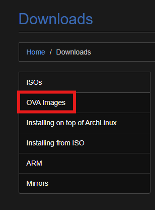
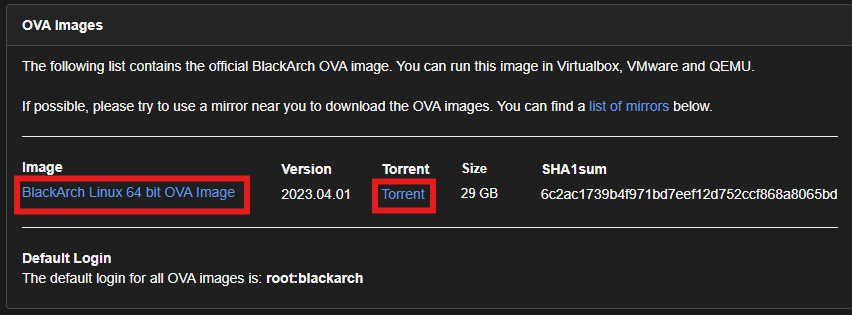
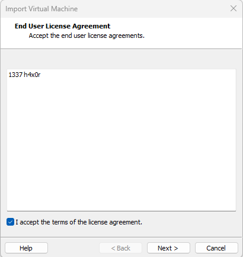
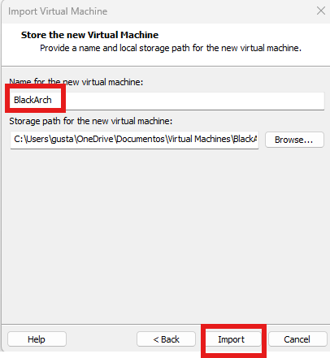
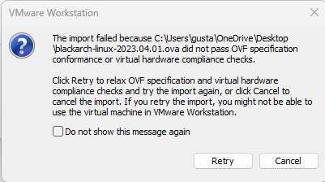
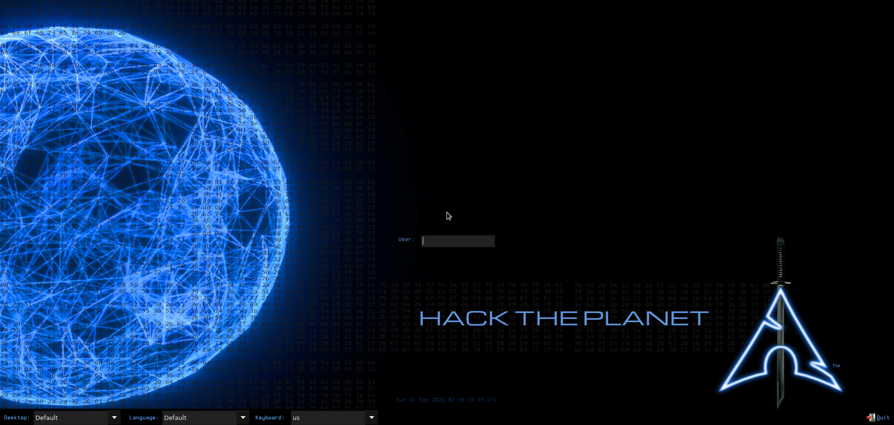
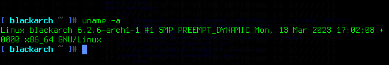
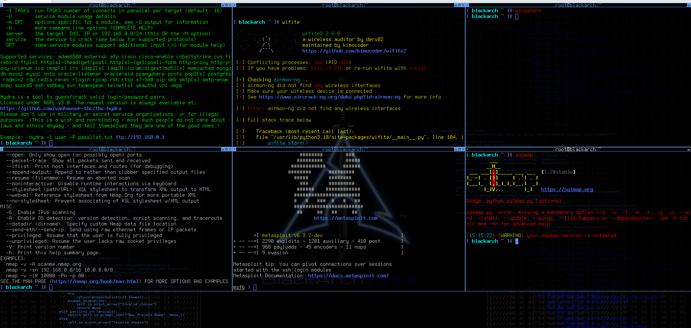

# 🛡️ Laboratorio: Instalación y Despliegue de BlackArch Linux OVA


## 📖 Descripción
Este proyecto documenta el proceso técnico de descarga, verificación, instalación y configuración inicial de **BlackArch Linux (OVA)** en un entorno virtualizado con VMware Workstation. BlackArch es una distribución de penetración basada en Arch Linux que contiene más de 2800 herramientas de seguridad.

---

## 📋 Especificaciones del Laboratorio

| Recurso | Asignado | Recomendado |
| :--- | :--- | :--- |
| **Sistema Operativo** | BlackArch Linux 2023.04.01 | Última versión estable |
| **Kernel** | 6.2.6-arch1-1 | - |
| **RAM** | 4 GB | 8 GB+ |
| **Disco Duro** | 30 GB (Thin Provisioning) | 128 GB |
| **Arquitectura** | x86_64 | x86_64 |

---

## 🔧 Pasos de Instalación

### 1. Descarga y Verificación
Se descargó la imagen OVA desde el repositorio oficial. Es crítico verificar el hash para asegurar la integridad de la imagen.
* **SHA1:** `6c2ac1739b4f971bd7eef12d752ccf868a8065bd`






### 2. Importación en VMware
Apertura del archivo `.ova` y configuración inicial de la máquina virtual.






### 3. Solución de Error de Importación (Troubleshooting)
Durante la importación, es común encontrar un error de conformidad OVF en VMware.
> **Solución:** Hacer clic en **"Retry"** para relajar las verificaciones de especificación OVF y permitir la importación.



---

## 🚀 Primer Inicio y Configuración

### Entorno de Escritorio
Tras la importación exitosa, el sistema arranca. Aquí se muestra la pantalla de acceso y el escritorio una vez iniciada la sesión (Imágenes 8 y 9):




### 🔐 Credenciales por Defecto
Estas son las credenciales predeterminadas de la imagen OVA:

| Usuario | Contraseña | Rol |
| :--- | :--- | :--- |
| `root` | **blackarch** | Superusuario |
| `blackarch` | **blackarch** | Usuario Estándar |

### Verificación del Sistema
Validación de la versión del kernel y arquitectura del sistema.
```bash
uname -a
```


## 🛠️ Herramientas Incluidas
BlackArch destaca por su inmenso repositorio (+2800 herramientas). Aquí un ejemplo verificando la ejecución de **SQLMap**:



## 🔄 Post-Instalación (Recomendado)
Al ser una distribución *Rolling Release*, se recomienda actualizar los llaveros criptográficos y el sistema antes de su uso intensivo.

### 1. Inicializar llaveros
```bash
sudo pacman-key --init
sudo pacman-key --populate blackarch
```
### 2. Actualizar sistema completo
```bash
sudo pacman -Syu
```


⚠️ Aviso Legal
Este laboratorio ha sido creado con fines educativos y de investigación. El autor no se hace responsable del mal uso de las herramientas aquí mostradas. Asegúrese de operar siempre en entornos controlados y bajo autorización.

---
<div align="center">
  <sub>By <a href="https://github.com/Gustaafvito">Gustaafvito</a></sub>
</div>


