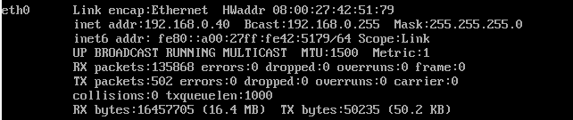
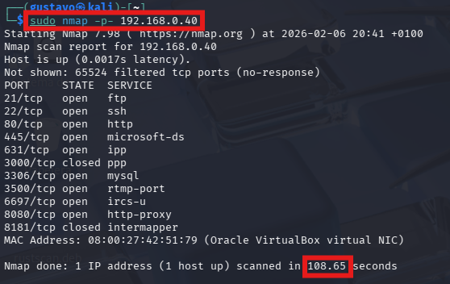
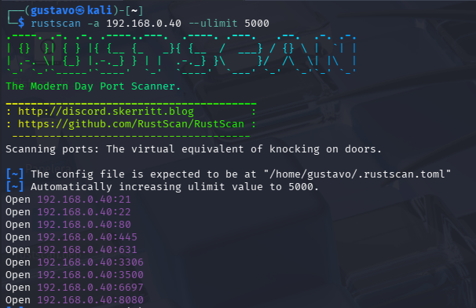
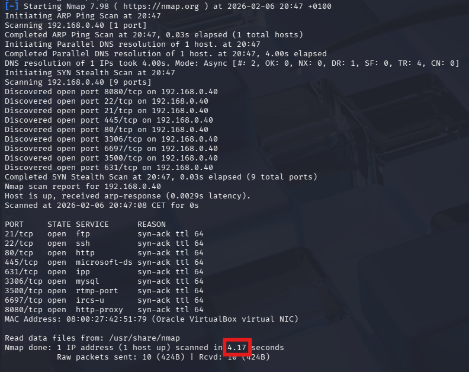
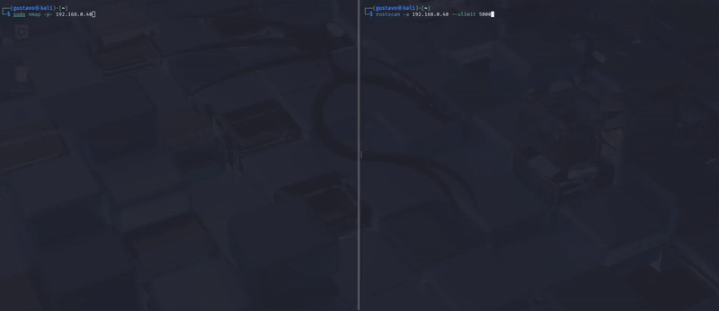

# ⚡ RustScan vs Nmap: Optimización de Pentesting (PoC)

## 📝 Descripción del Proyecto
Este laboratorio es una Prueba de Concepto (PoC) diseñada para demostrar la diferencia crítica de rendimiento entre un escaneo de puertos tradicional y uno optimizado mediante sockets asíncronos.

Se simula un escenario de auditoría interna donde el tiempo es un factor limitado, comparando la herramienta estándar de la industria (**Nmap**) contra la alternativa moderna basada en Rust (**RustScan**).

## 🏗️ Arquitectura del Laboratorio
El entorno fue virtualizado y aislado para realizar las pruebas de forma segura:

* **Máquina Atacante:** Kali Linux 2024 (VMware Workstation).
* **Máquina Víctima:** Metasploitable 3 (Ubuntu 14.04 en VirtualBox).
* **Configuración de Red:** Modo Puente (Bridged Adapter) en ambos hipervisores para permitir la comunicación directa dentro de la misma subred local.

---

## 🛠️ Paso 1: Identificación del Objetivo
Antes de iniciar el ataque, verificamos la conectividad y la dirección IP de la máquina víctima. Confirmamos que Metasploitable 3 está activo y expuesto en la red.

* **IP del Objetivo:** `192.168.0.40`
* **Estado:** Conectividad confirmada.



---

## 🐢 Paso 2: El Método Tradicional (Nmap Standalone)
Ejecutamos un escaneo estándar para cubrir todo el rango de puertos TCP (0-65535). Este método es exhaustivo pero secuencial, lo que genera un cuello de botella significativo.

### Comando Ejecutado:
```bash
sudo nmap -p- 192.168.0.40
```

### Análisis del Proceso:
Como se observa en el clip inferior, Nmap tarda considerablemente en recorrer los puertos cerrados antes de encontrar los abiertos.


### Resultado:
* **Tiempo Total:** **108.65 segundos** (1 min 48 seg).
* **Conclusión:** Aunque efectivo, es demasiado lento para fases iniciales de reconocimiento en redes grandes.



---

## 🚀 Paso 3: El Método Moderno (RustScan + Nmap)
Utilizamos RustScan para aprovechar su capacidad de escaneo asíncrono. La estrategia consiste en que RustScan encuentre los puertos abiertos en milisegundos y se los pase automáticamente a Nmap para analizar versiones.

### Comando Ejecutado:
```bash
rustscan -a 192.168.0.40 --ulimit 5000 -- -sV
```
* `--ulimit 5000`: Aumenta el límite de archivos abiertos para maximizar la velocidad.
* `-- -sV`: Pasa los argumentos a Nmap para detectar versiones de servicios.

### Análisis del Proceso:
RustScan identifica los puertos casi instantáneamente (ver clip) y comienza el análisis de servicios inmediatamente.


### Detección Inicial:
En menos de un segundo, RustScan ya ha identificado los puertos abiertos:



### Resultado Final (Integración):
Al finalizar el "piping" con Nmap, obtenemos el mismo resultado detallado pero en una fracción del tiempo.

* **Tiempo Total:** **4.17 segundos**.



---

## ⚔️ Conclusiones y Comparativa Visual (Showdown)

La diferencia de rendimiento es abismal. RustScan logra reducir el tiempo de espera en un **96%**, permitiendo al pentester enfocarse en la explotación casi de inmediato.

| Herramienta | Tiempo de Ejecución | Eficiencia |
| :--- | :--- | :--- |
| **Nmap (Clásico)** | 108.65s | Baja |
| **RustScan** | 4.17s | **Extrema** |

### 🎥 La Prueba Definitiva (Split Screen)
A la izquierda el método tradicional, a la derecha la optimización con RustScan:



---
*Laboratorio realizado por [Gustaafvito](https://github.com/Gustaafvito)*
