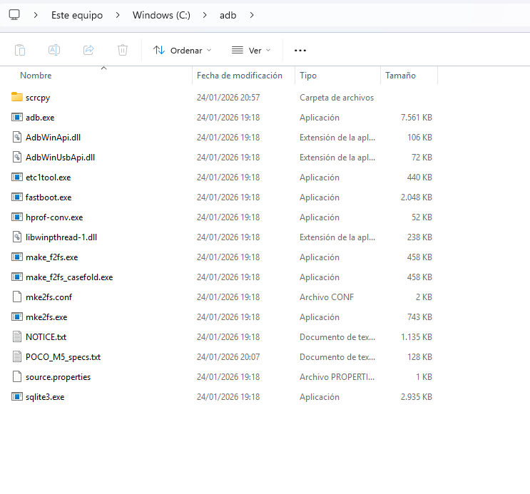
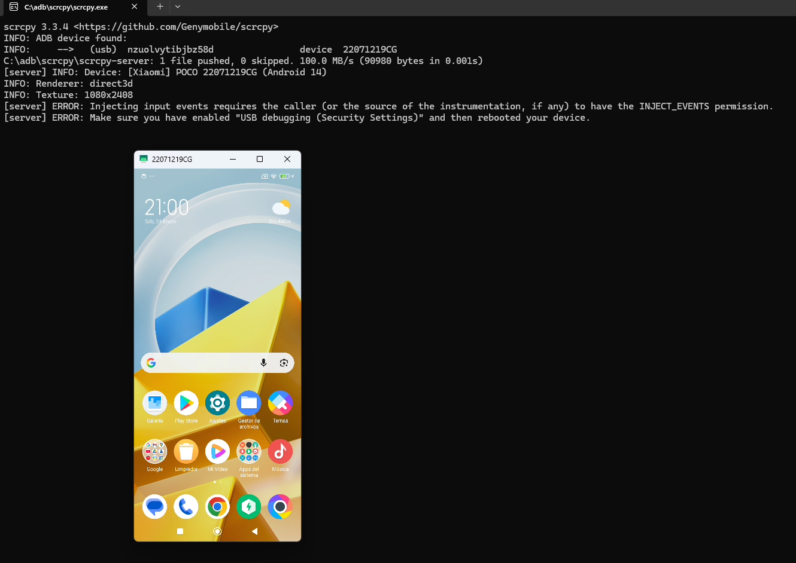

# 🛠️ Configuración del Entorno: ADB y Fastboot

Guía de instalación de las herramientas **Android Debug Bridge (ADB)** en Windows. Este es el paso previo necesario antes de conectar cualquier móvil.

## 📋 Requisitos
* PC con Windows.
* Descarga oficial: [SDK Platform-Tools](https://developer.android.com/tools/releases/platform-tools)

---

## 🚀 1. Instalación Manual

1.  Crear una carpeta llamada `adb` en la raíz del disco local `C:\`.
2.  Descomprimir el contenido del ZIP descargado dentro de esa carpeta.

**Resultado Correcto:**
La ruta debe ser `C:\adb\` y contener los ejecutables `adb.exe` y `fastboot.exe`:

---

## ✅ 2. Verificación del Sistema

Para confirmar que la herramienta funciona, abrimos una terminal y consultamos la versión.

1.  Abrir PowerShell en la carpeta `C:\adb`.
2.  Ejecutar el comando: `.\adb version`

**Resultado Correcto:**
El sistema devuelve la versión instalada, confirmando que ADB está listo para usarse:

---
# 🛠️ Configuración de Herramientas de Visualización

## Scrcpy (Screen Copy)
Herramienta de código abierto que permite visualizar y controlar dispositivos Android conectados vía USB (o TCP/IP). No requiere acceso *root* en el dispositivo.

**Ubicación en el Lab:** `C:\adb\scrcpy\`

### 1. Obtención del Software
Descargamos la última versión estable directamente desde el repositorio oficial para garantizar la integridad de la cadena de suministro.

### 2. Instalación (Estructura de Directorios)
Para mantener la limpieza del entorno y evitar conflictos de permisos con `adb.exe` en la raíz, desplegamos la herramienta en su propio subdirectorio.
- **Ruta:** `C:\adb\scrcpy\`

### 3. Ejecución y Permisos
Al ejecutar `scrcpy.exe` por primera vez, Windows Defender SmartScreen puede solicitar confirmación debido a que es una herramienta de hacking ético/desarrollo no firmada por Microsoft.
- **Acción:** Seleccionar "Más información" -> "Ejecutar de todas formas".

## 4. Validación de Funcionamiento
La ejecución es exitosa. Como se observa en la evidencia, el sistema despliega dos ventanas:

1.  **Consola de comandos:** Muestra el registro de conexión ADB (incluyendo el aviso de seguridad específico de Xiaomi en rojo, que abordaremos en la nota inferior).
2.  **Ventana Espejo (POCO M5):** Visualización en tiempo real de la pantalla del dispositivo, confirmando el control remoto.

### 📚 Autor: Gustavo Luis Sánchez Escobar
*CyberSecurity Researcher | Pentesting · OSINT · Linux* 📅 **2026**
