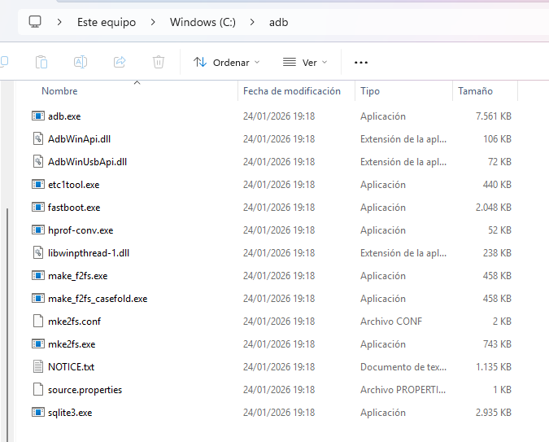
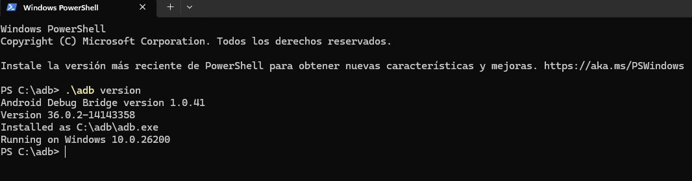

# 🛠️ Configuración del Entorno: ADB y Fastboot

Guía de instalación de las herramientas **Android Debug Bridge (ADB)** en Windows. Este es el paso previo necesario antes de conectar cualquier móvil.

## 📋 Requisitos
* PC con Windows.
* Descarga oficial: [SDK Platform-Tools](https://developer.android.com/tools/releases/platform-tools)

---

## 🚀 1. Instalación Manual

1.  Crear una carpeta llamada `adb` en la raíz del disco local `C:\`.
2.  Descomprimir el contenido del ZIP descargado dentro de esa carpeta.

**Resultado Correcto:**
La ruta debe ser `C:\adb\` y contener los ejecutables `adb.exe` y `fastboot.exe`:



---

## ✅ 2. Verificación del Sistema

Para confirmar que la herramienta funciona, abrimos una terminal y consultamos la versión.

1.  Abrir PowerShell en la carpeta `C:\adb`.
2.  Ejecutar el comando: `.\adb version`

**Resultado Correcto:**
El sistema devuelve la versión instalada, confirmando que ADB está listo para usarse:



---
## 🛠️ Herramientas de Visualización y Control

### Scrcpy (Screen Copy)
Herramienta de código abierto para visualizar y controlar dispositivos Android conectados por USB (o TCP/IP) desde el PC. No requiere acceso *root*.

#### Instalación
1.  Descargar la última versión de `scrcpy` para Windows (x64).
2.  Descomprimir el contenido dentro de la carpeta principal de herramientas (ej. `C:\adb\`).
    * *Nota:* Se recomienda sobrescribir los archivos `adb.exe` y `.dll` si `scrcpy` trae versiones más recientes.

#### Uso
Ejecutar desde terminal (PowerShell/CMD) en el directorio de trabajo:
```powershell
.\scrcpy

## ⏭️ Siguientes Pasos
Ahora que el entorno está configurado, el siguiente paso es ir a la carpeta específica del dispositivo (ej: `/POCO_M5`) para realizar la conexión y extracción de datos.
