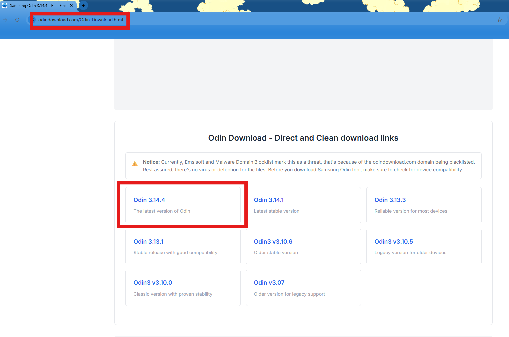
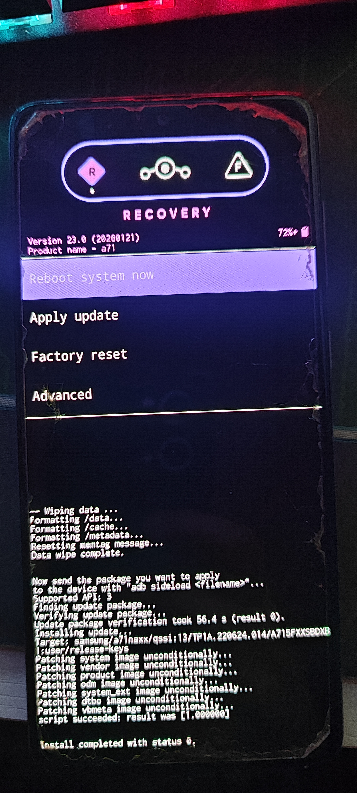
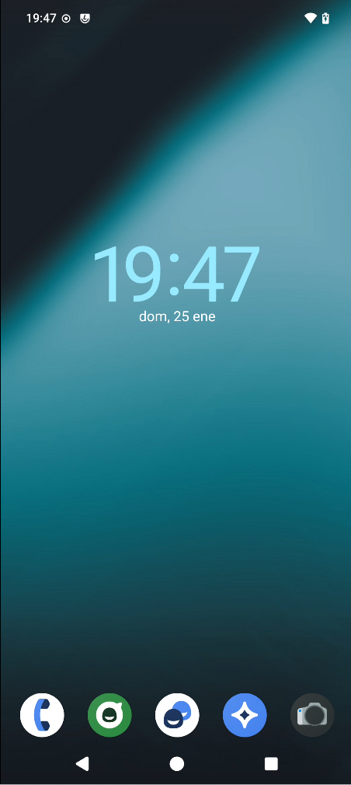

# 🛡️ PROYECTO: La Joya de la Privacidad (Samsung Galaxy A71)

| Parámetro | Detalle |
| :--- | :--- |
| **Dispositivo** | Samsung Galaxy A71 (SM-A715F) |
| **Codename** | `a71` |
| **Arquitectura** | Snapdragon 730 (Qualcomm) |
| **Estado Inicial** | OneUI 5.1 (Android 13) - Bloatware Samsung/Google |
| **Estado Final** | **LineageOS 23 (Android 16)** - De-Googled |
| **Fecha** | Enero 2026 |

---

### ⚠️ AVISO LEGAL Y EXENCIÓN DE RESPONSABILIDAD

> **Advertencia sobre la Garantía y Riesgos**
>
> La información y herramientas proporcionadas en este repositorio implican la modificación de particiones críticas del sistema.
>
> 1.  **Anulación de Garantía:** El desbloqueo del bootloader provoca la activación irreversible del fusible electrónico KNOX (0x1). Esto anula la garantía oficial de Samsung y deshabilita permanentemente funciones de seguridad como Samsung Pay, Secure Folder y Samsung Pass.
> 2.  **Riesgo de Daños:** El autor de esta documentación no se hace responsable de daños en el hardware (bricking), pérdida de datos o mal funcionamiento del dispositivo derivado de la ejecución de estos procedimientos.
> 3.  **Responsabilidad del Usuario:** El usuario asume toda la responsabilidad sobre las modificaciones realizadas en su terminal. Se recomienda realizar una copia de seguridad completa antes de proceder.

---

## 🎯 1. Objetivo de la Misión
El objetivo principal es recuperar la soberanía del dispositivo. Los terminales Samsung de fábrica incluyen capas de software (Knox, OneUI) y servicios de Google que monitorean la actividad del usuario y consumen recursos en segundo plano.

**Metas Alcanzadas:**
1.  **Eliminación de Obsolescencia:** Actualización no oficial a Android 16 (el soporte oficial terminó antes).
2.  **Privacidad:** Eliminación de GApps (Google Apps) y telemetría de Samsung.
3.  **Rendimiento:** Instalación de un sistema operativo limpio (AOSP based).

---

## 🛠️ 2. Arsenal y Preparación (Host & Target)

Para la intervención se requirió un entorno específico debido a las restricciones de Samsung (protocolo Odin en lugar de Fastboot estándar).

### Software en PC (Windows 11):
* **Odin v3.14.4:** Herramienta de flasheo propietaria para comunicar con el bootloader Loke de Samsung.
    * *Evidencia:* Descarga desde repositorio no oficial y ejecución.
    
    
* **7-Zip:** Necesario para manipular archivos `.tar`.
* **ADB & Fastboot:** Platform Tools de Google para la inyección del sistema (Sideload).
* **Drivers Samsung USB:** Para reconocimiento de puertos COM.

### Archivos del Sistema (Target):
Se descargaron las imágenes oficiales de la build `lineage-23.0` para `a71`.
* `recovery.img` (El bisturí).
* `vbmeta.img` (Para anular la verificación de arranque).
* `lineage-*.zip` (El nuevo cerebro).

> **Organización de Archivos:**

> 

---

## 📝 3. Bitácora de Ejecución (Paso a Paso)

### FASE I: Reconocimiento y Habilitación
Antes de atacar el bootloader, es necesario preparar el sistema operativo original para permitir su propia destrucción.

1.  **Verificación de Software:** Confirmamos la compilación para asegurar compatibilidad.
    

2.  **Modo Desarrollador:** Activación mediante 7 toques en el número de compilación.
    

3.  **Desbloqueo OEM (El Interruptor Maestro):**
    Esta es la clave. Sin esto, el dispositivo rechaza cualquier binario no firmado. Se requiere conexión Wi-Fi previa para validar el estado "KG State" y que aparezca la opción.
    

---

### FASE II: La Brecha (Desbloqueo del Bootloader)
Procedimiento físico para eliminar la firma digital de Samsung.

* **Acción:** Apagar dispositivo. Conectar USB manteniendo `Vol+` y `Vol-`.
* **Confirmación:** En la pantalla de advertencia (Pantalla Turquesa), mantenemos pulsado `Vol+` (Unlock Mode).

1.  **Solicitud de Confirmación:** El sistema advierte sobre la anulación de garantía y borrado de datos.
    

2.  **Resultado - Bootloader Abierto:**
    Al reiniciar, el sistema muestra el "Triángulo de la Muerte" (Advertencia de seguridad). Esto confirma que **la seguridad de arranque ha sido desactivada**.
    

---

### FASE III: Inyección del Recovery (La Cirugía)
Con el bootloader abierto, sustituimos el Recovery de Samsung por el de LineageOS.

**1. Preparación del Paquete TAR:**
Odin no acepta `.img` sueltos. Empaquetamos `recovery.img` + `vbmeta.img` en un archivo `lineage_recovery.tar`.

**2. Configuración Crítica de Odin:**
* **AP Slot:** Cargamos nuestro archivo `.tar`.
* **Auto Reboot:** **OFF** (Desactivado). *Esto es vital. Si se deja activado, Android reinicia y restaura el recovery original antes de que podamos usar el nuevo.*
  
    

**3. Ejecución (Modo Download):**
Ponemos el móvil en modo descarga (Pantalla Verde) y confirmamos conexión en Puerto COM.
    

**4. Confirmación de Éxito:**
Odin muestra **PASS!** en verde. La inyección de la partición de recuperación ha sido exitosa.
    

---

### FASE IV: Trasplante de Sistema (Instalación de ROM)
Accedemos al nuevo Recovery (pulsando `Vol+` y `Power` al reiniciar forzosamente).

**1. Entorno Lineage Recovery:**
Interfaz gráfica del nuevo recovery cargada correctamente.
    

**2. Limpieza (Wipe):**
Ejecutamos `Factory Reset` -> `Format Data` para eliminar el cifrado antiguo de Samsung.

**3. Carga Lateral (ADB Sideload):**
Activamos el modo `Apply from ADB` en el móvil y enviamos el sistema desde el PC.

* **Comando PC:**
    ```powershell
    .\adb sideload lineage-23.0-20260121-nightly-a71-signed.zip
    ```

* **Log de Transmisión (PC):**
    El PC confirma el envío del paquete (`Total xfer: 1.00x`).
    

* **Log de Recepción (Móvil):**
    El dispositivo verifica la firma del ZIP, parchea las particiones del sistema y confirma el éxito (`Install completed with status 0`).
    

---

## 🏆 4. Estado Final y Verificación

Tras reiniciar, el sistema arranca en **LineageOS**. Se realizan las verificaciones finales de integridad y versión.

### 🖥️ Interfaz de Usuario
Escritorio limpio, sin bloatware, utilizando el launcher Trebuchet de código abierto.
> 

### ⚙️ Especificaciones Técnicas
Confirmación absoluta del éxito de la operación:
* **Versión de Android:** 16 (Upside Down Cake / Baklava).
* **Versión LineageOS:** 23.0 Nightly.
* **Kernel:** Actualizado y libre de modificaciones de operador.

> 

---
**✅ CONCLUSIÓN:**
La operación ha sido un éxito total. El Samsung Galaxy A71 ha pasado de ser un dispositivo obsoleto y vigilado a ser una herramienta de privacidad potente y actualizada.
