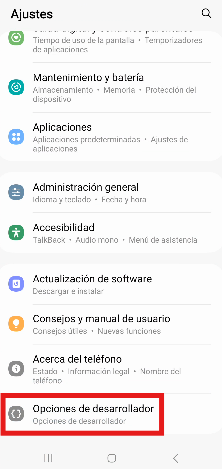

# 📱 Samsung Galaxy A71 (SM-A715F) - Auditoría y Conexión

Documentación técnica del proceso de conexión y configuración del dispositivo para el laboratorio de seguridad móvil.

## 🛠️ 1. Preparación del Entorno (Modo Desarrollador)

El primer paso crítico es habilitar el puente de depuración (ADB) oculto por defecto en Android 13 (One UI 5.1).

### Habilitar opciones de desarrollo
Navegamos a **Ajustes > Información de software** y pulsamos 7 veces sobre el número de compilación.

> **Evidencia:**
> 

### Activar Depuración USB
Una vez habilitado el menú secreto, accedemos a **Opciones de desarrollador** y activamos el interruptor de depuración.

> **Evidencia:**
> 

## 💻 2. Conexión Exitosa con Scrcpy

Tras conectar el cable USB y aceptar la huella RSA en el dispositivo, establecemos la conexión.

**Comando ejecutado:**
```bash
scrcpy
```

### 🔓 3. Desbloqueo de Bootloader (El paso crítico)

Tras verificar la conexión, confirmamos que la opción **Desbloqueo de OEM** está disponible y la activamos.

> **⚠️ AVISO:** Al activar este interruptor y proceder con el desbloqueo físico, la seguridad KNOX se romperá (0x1) y la garantía se anulará.

> **Evidencia:**
> 

---
**Estado actual:** Listo para `Download Mode` y flasheo de Recovery.

### 🔓 4. Confirmación Física del Desbloqueo

El dispositivo entra en modo de descarga y solicita confirmación física.

> **Paso 1: Confirmación**
> Pulsamos **Volumen Arriba** (Long Press) para entrar en modo Unlock y luego un toque corto para confirmar.
> 

> **Paso 2: Resultado**
> Al reiniciar, el sistema muestra la advertencia de seguridad que confirma el estado **UNLOCKED**.
> 

---
**✅ ESTADO FINAL:** Bootloader abierto. KNOX 0x1. Listo para flashear Custom Recovery.
