# 📱 POCO M5 - "El Atacante Rápido"
**Estado de la Misión:** 🟡 En Configuración (Fase 2)
**Objetivo:** Despliegue de Kali NetHunter Rootless

## 1. Conexión y Reconocimiento (ADB)
Para iniciar la auditoría, establecimos la conexión mediante el puente de depuración (ADB).

### 1.1 Autorización del Dispositivo
Tras activar las "Opciones de desarrollador" y la "Depuración USB", realizamos el handshake RSA.
- **Comando:** `./adb devices`
- **Resultado:** El dispositivo pasó de `unauthorized` a `device`, confirmando control total.

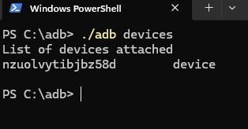

### 1.2 Extracción de Ficha Técnica (Forensics)
En lugar de tomar notas manuales, realizamos un volcado completo de las propiedades del sistema (`build.prop`) para tener una referencia exacta del hardware y software.

- **Comando ejecutado:**
  ```powershell
  ./adb shell getprop > POCO_M5_specs.txt

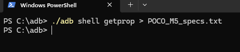
> **💡 ¿Qué hace este comando?**
> * **`adb shell`**: Abre una puerta para enviar órdenes directas al sistema operativo del móvil.
> * **`getprop`**: Abreviatura de *"Get Properties"* (Obtener Propiedades). Le pide al dispositivo su "ADN" completo: modelo de procesador, versión de seguridad, configuración de pantalla, etc.
> * **`>`**: Este símbolo es un **operador de redirección**. En lugar de escupir las miles de líneas de texto en la pantalla de la terminal, las "vuelca" silenciosamente dentro del archivo `.txt` para guardarlas como evidencia.

### 1.3 Verificación de la Evidencia
Se generó correctamente el archivo `POCO_M5_specs.txt` en el directorio de trabajo, conteniendo todas las flags del sistema (versión de SDK, configuración de Bluetooth, detalles del kernel, etc.).


---

## 2. Fase 2: Despliegue de Infraestructura (Kali NetHunter)

En esta fase transformamos el dispositivo de un teléfono estándar a una herramienta de auditoría. El objetivo es desplegar **Kali NetHunter Rootless**, una versión de la suite de pentesting diseñada para funcionar sobre una capa de abstracción sin modificar la partición del sistema (sin Root).

### 2.1 Arquitectura del Entorno
Para lograr la ejecución de herramientas Linux sobre Android sin privilegios de superusuario, dependemos de un entorno *chroot* (o *proot*) gestionado por un emulador de terminal.

* **Motor Base:** Termux.
* **Capa de Compatibilidad:** Proot-Distro (simula el acceso a directorios raíz).
* **Interfaz:** KeX (Kali Desktop Experience) para entorno gráfico o CLI para consola.

### 2.2 Selección de Fuentes de Software (Supply Chain Security)
Durante la planificación, se descartó el uso de *Google Play Store* para la obtención de herramientas críticas.

| Fuente | Estado | Decisión | Justificación Técnica |
| :--- | :--- | :--- | :--- |
| **Google Play** | ❌ Deprecated | **DESCARTADO** | La versión de Termux en Play Store no recibe actualizaciones debido a restricciones en la API de Android 10+ (targetSdkVersion). Su uso provoca fallos en la gestión de repositorios (`apt update`). |
| **F-Droid** | ✅ Active | **APROBADO** | Repositorio de Software Libre (FOSS). Garantiza binarios firmados por el desarrollador original y compatibilidad total con los scripts de instalación de NetHunter. |

---
### 2.3 Implementación de la Fuente Segura (F-Droid)
Procedemos a la instalación del cliente F-Droid para gestionar los paquetes de software libre necesarios para la auditoría.

**1. Obtención del Binario (Source Validation)**
Accedemos al portal oficial (`f-droid.org`) para descargar el paquete `.apk`. Esto garantiza la integridad del instalador y evita versiones adulteradas de terceros.


**2. Confirmación de Instalación**
El sistema solicita confirmación para desplegar el paquete. Al no provenir de Google Play, se valida manualmente el permiso de instalación.

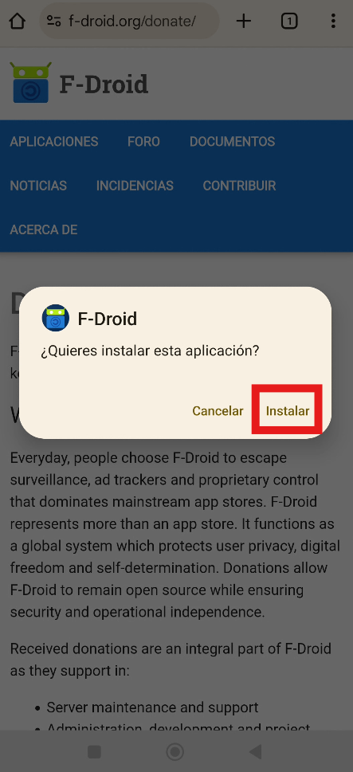

**3. Sincronización de Repositorios**
Tras el primer inicio, el cliente actualiza los índices de software (mirrors). La carga correcta de los iconos confirma que tenemos conexión segura con el repositorio FOSS y estamos listos para descargar Termux.


### 2.4 Despliegue del Motor Base (Termux)
Una vez establecido el repositorio seguro, procedemos a instalar el emulador de terminal principal. Este componente proveerá el entorno Linux (espacio de usuario) necesario para ejecutar las herramientas de Kali.

**Selección del Paquete:**
Dentro de F-Droid, seleccionamos el paquete "Termux Emulador de terminal con paquetes".

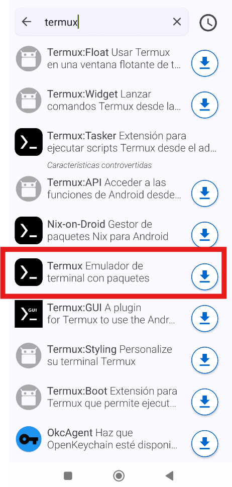

### 2.5 Evasión de Restricciones de Seguridad (Troubleshooting)
Durante la instalación, el subsistema **Google Play Protect** puede bloquear el despliegue del paquete. Esto es un comportamiento esperado (falso positivo) dado que Termux no cumple con las directrices de API modernas de Google (target SDK restrictions) para mantener su funcionalidad de sistema.

* **Acción Correctiva:** Seleccionar "Más detalles" -> "Instalar de todas formas".


### 2.6 Inicialización del Entorno (Shell)
Tras la ejecución inicial, el sistema realiza el *bootstrap* (instalación de paquetes esenciales: `bash`, `coreutils`, `tar`, etc.).
La aparición del prompt `$` confirma que el **User Space Linux** está activo y listo para recibir comandos.

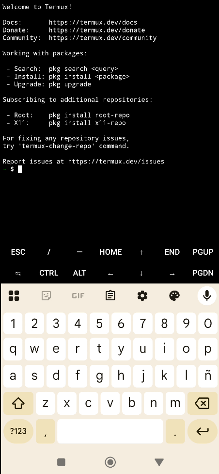

---

### 2.7 Puesta a Punto (System Update)
Antes de desplegar herramientas ofensivas, es crítico asegurar que el entorno base tenga los últimos parches de seguridad y dependencias. Ejecutamos la actualización completa de los repositorios y paquetes del sistema.

- **Comando:** `pkg update -y && pkg upgrade -y`

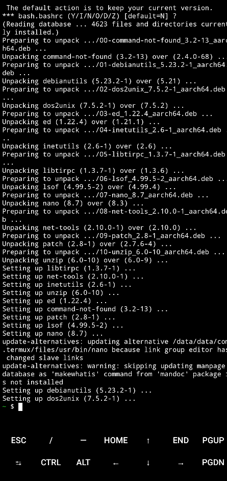

---
## 3. Fase 3: Instalación de Kali NetHunter (Rootless)

En esta fase descargamos e instalamos el sistema operativo de pentesting sobre la capa de emulación Termux.

### 3.1 Preparación de Herramientas de Red
Termux requiere un gestor de descargas por línea de comandos para obtener el script de instalación oficial.

- **Herramienta:** `wget` (GNU Wget).
- **Comando:** `pkg install wget -y`

**Validación:**
Comprobamos que el binario está accesible en el `PATH` del sistema.

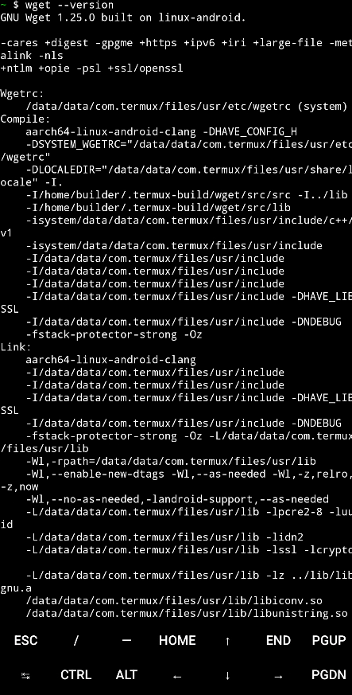

---
### 3.2 Obtención del Instalador
Descargamos el script oficial de Offensive Security. Este script automatiza la descarga de la imagen del sistema de archivos (rootfs) y configura el entorno *proot* para que Kali funcione sobre el kernel de Android.

- **Comando:** `wget -O install-nethunter-termux https://offs.ec/2MceZWr`
- **Integridad:** El servidor responde con código 200 OK y guarda el fichero `install-nethunter-termux`.


---
### 3.3 Inicialización y Selección de Imagen
Ejecutamos el instalador (`./install-nethunter-termux`). El script verifica la arquitectura del procesador (ARM64) y presenta las ediciones disponibles:
1.  **Full:** Contiene todas las herramientas (Metasploit, Nmap, etc.). Recomendada.
2.  **Minimal:** Solo herramientas básicas.
3.  **Nano:** Instalación ultra-ligera.

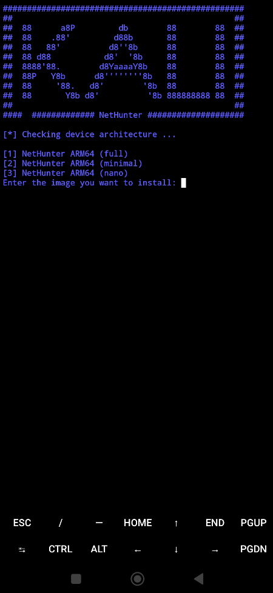

---
### 3.4 Despliegue de la Imagen (Rootfs)
El sistema procede a la descarga del archivo `rootfs` (sistema de archivos) completo.
- **Tamaño:** ~2.1 GB.
- **Tiempo de ejecución:** ~15 minutos (dependiendo del ancho de banda).
- **Extracción:** Una vez descargado, el script descomprime el contenedor automáticamente.

**Validación:**
El sistema solicita confirmación para eliminar el archivo comprimido original. La aparición de este mensaje confirma que la extracción ha finalizado sin errores.

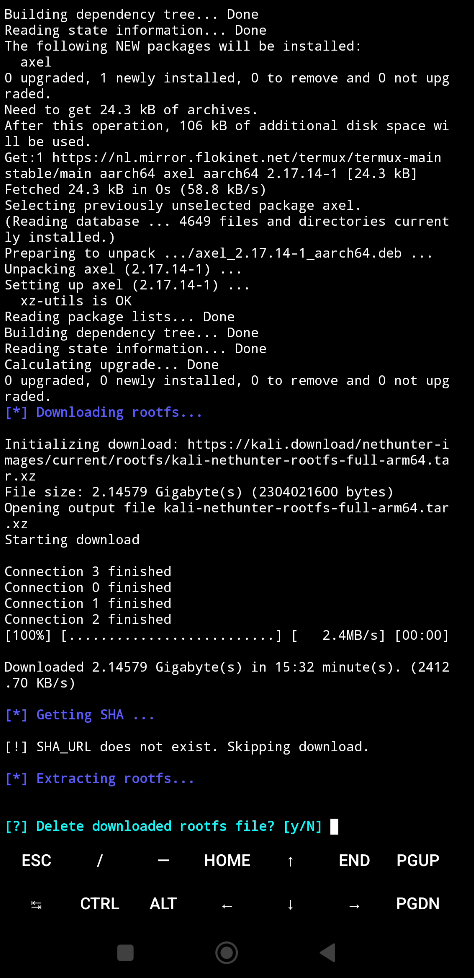

---
### 3.5 Finalización y Limpieza
Tras la extracción del sistema de archivos, el instalador configura los scripts de arranque en `/data/data/com.termux/files/usr/bin/`.
- **Limpieza:** Se conserva el archivo rootfs descargado (elección "No" al borrado) como medida de respaldo para futuras reconfiguraciones.
- **Resultado:** El banner "Installed successfully" confirma que el entorno `proot` está enlazado correctamente.

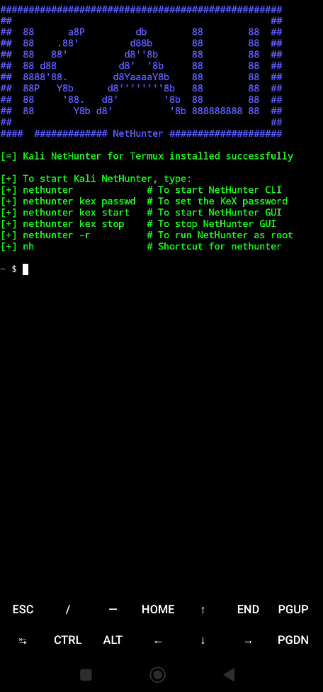

---
### 3.6 Acceso al Entorno (Shell Kali)
Para iniciar la sesión en el sistema ofensivo, utilizamos el atajo configurado en el `PATH`.
- **Comando:** `nh` (o `nethunter`).
- **Verificación:** El cambio del prompt a `(kali@localhost)` indica que la sesión terminal ha sido transferida exitosamente al entorno *chroot* de Kali Linux.


---
## 4. Fase 4: Despliegue de Interfaz Gráfica (KeX)

Para habilitar el entorno de escritorio completo (XFCE), configuramos el servidor VNC (Virtual Network Computing) integrado en NetHunter.

### 4.1 Seguridad de Acceso (VNC Password)
Establecemos las credenciales de autenticación para el servidor gráfico. Esto protege la sesión visual contra conexiones no autorizadas locales.
- **Comando:** `kex passwd`
- **Configuración:** Se define una clave de escritura (Full Access) y se descarta la clave de solo lectura (View-only).

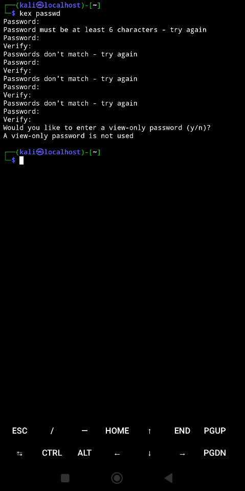

### 4.2 Cliente de Visualización (KeX App)
Para renderizar el entorno de escritorio XFCE, utilizamos el cliente VNC optimizado "NetHunter KeX". Esta aplicación no se encuentra en Google Play, por lo que se obtiene desde el repositorio dedicado de Kali.


### 4.3 Configuración del Cliente
Abrimos la aplicación NetHunter KeX y preparamos los parámetros de conexión.
- **Connection Type:** Basic VNC.
- **Target:** localhost:1 (El puerto por defecto para el display :1 es 5901).
- **Auth:** Requiere la contraseña definida previamente.


### 4.4 Inicialización del Servicio Gráfico
Desde la terminal de Kali, lanzamos el servidor VNC.
- **Comando:** `kex`
- **Resultado:** El sistema levanta el proceso Xtigervnc en el puerto `5901` (Display :1). La sesión queda activa en segundo plano.


