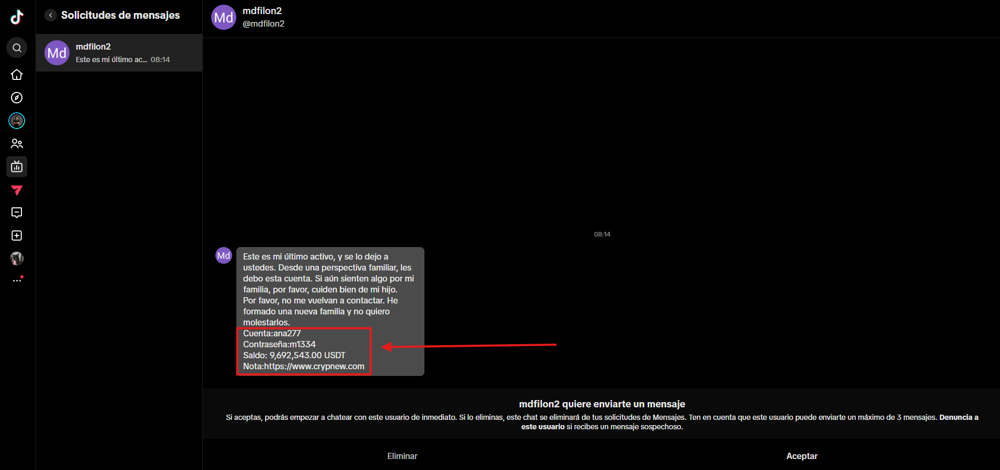
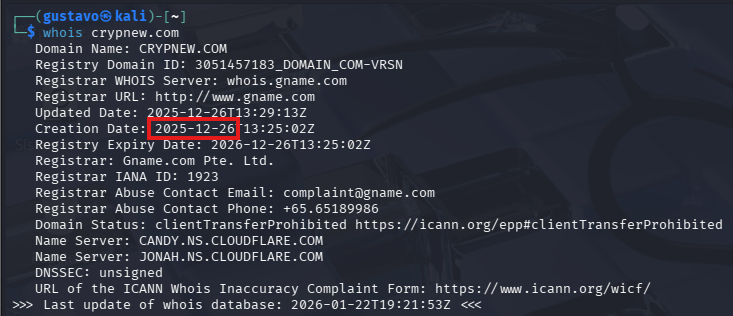
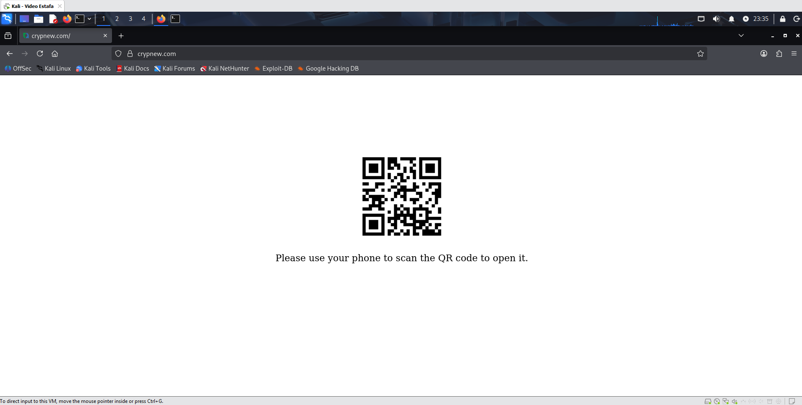
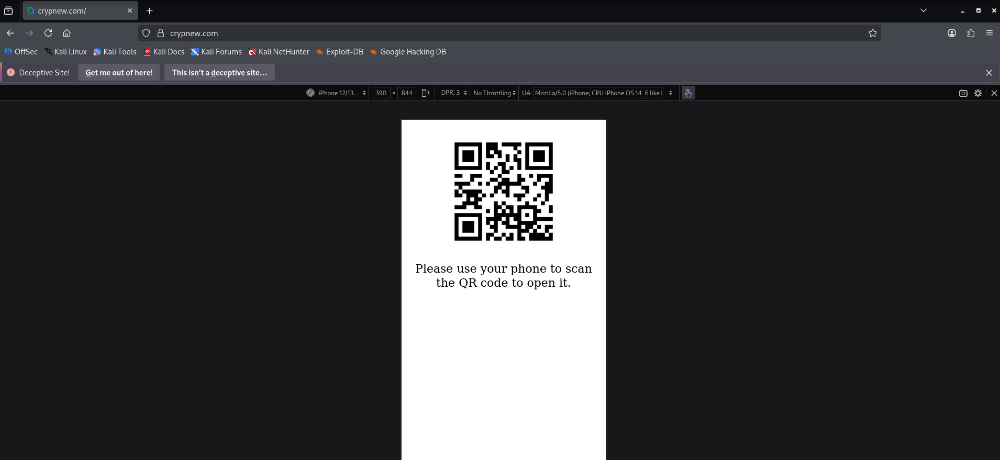
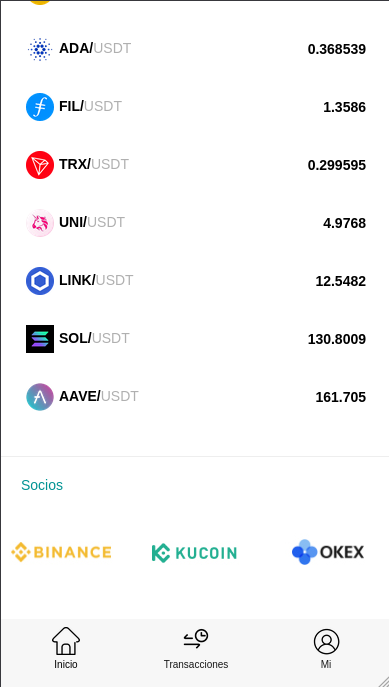
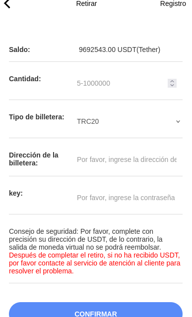
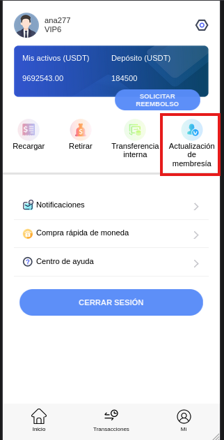
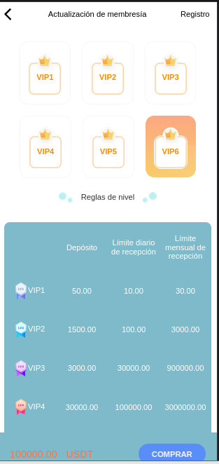
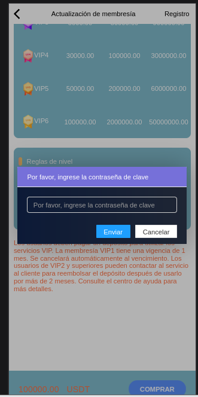

# 🕵️‍♂️ Análisis de Ciberinteligencia: Campaña de Phishing "CrypNew"

> **⚠️ DISCLAIMER (Descargo de Responsabilidad)**
> Este repositorio contiene análisis de malware, dominios fraudulentos y técnicas de ingeniería social con fines estrictamente **educativos y de investigación**.
> * No interactúes con los dominios maliciosos mencionados sin el conocimiento y las herramientas adecuadas.
> * El autor no se hace responsable del mal uso de la información aquí expuesta.

---

## 🛡️ Configuración del Entorno (Lab Setup)
Para garantizar la seguridad durante la investigación y evitar la exposición de mi red local, este análisis se ha realizado bajo un entorno estrictamente controlado:

* **Aislamiento:** Máquina Virtual (VM) dedicada y aislada del host principal (Sandbox).
* **Anonimato:** Conexión a través de **Mullvad VPN** para enmascarar la IP de origen y evitar el rastreo por parte de los atacantes.
* **Herramientas:** Navegador endurecido y herramientas de análisis pasivo.

---

# Fase 1: El Gancho (Initial Access Hook)

## Descripción del Evento
El punto de entrada es un mensaje directo recibido a través de una plataforma de redes sociales (TikTok). El atacante utiliza una técnica de Ingeniería Social basada en la urgencia emocional y la avaricia financiera (cebo de criptomonedas).

## Análisis de la Captura (Evidencia 1)
**Remitente:** @mdfilon2
**Plataforma:** Interfaz móvil (TikTok DM)

### Texto del Mensaje:
> "Este es mi último activo, y se lo dejo a ustedes. Desde una perspectiva familiar, les debo esta cuenta. Si aún sienten algo por mi familia, por favor, cuiden bien de mi hijo. Por favor, no me vuelvan a contactar. He formado una nueva familia y no quiero molestarlos."

### Datos del "Cebo" (Payload):
El atacante proporciona credenciales falsas para incitar a la víctima a visitar un sitio web fraudulento.

* **Cuenta:** `ana277`
* **Contraseña:** `m1334`
* **Saldo Prometido:** `9,692,543.00 USDT` (Tether)
* **Dominio Malicioso (Target):** `https://www.crypnew.com`

## Objetivo del Análisis
Determinar la infraestructura detrás del dominio `crypnew.com` y validar si se trata de una estafa de tipo "Pig Butchering" o un esquema de phishing de credenciales/fees.

---

# Fase 2: Reconocimiento de Infraestructura (OSINT)

## Análisis de Dominio (Whois)
Ante la sospecha, se procedió a realizar una consulta `whois` sobre el dominio proporcionado en el mensaje (`crypnew.com`) para identificar su antigüedad y registrador.

### 🚩 Hallazgos Clave (Red Flags):
* **Dominio:** `CRYPNEW.COM`
* **Registrador:** Gname.com Pte. Ltd. (Un registrador offshore comúnmente utilizado para alojar sitios de apuestas y estafas por su laxitud).
* **Fecha de Creación:** `2025-12-26`
* **Protección:** El sitio está detrás de **Cloudflare** (`CANDY.NS...`, `JONAH.NS...`), lo que oculta la dirección IP real del servidor de origen.

### Conclusión de Inteligencia:
Existe una **discrepancia crítica**. El estafador narra una historia de vida ("mi último activo", "he formado una nueva familia"), sugiriendo una cuenta con antigüedad. Sin embargo, el dominio **fue creado hace menos de un mes** (diciembre 2025).

Esto confirma que la plataforma no es un exchange legítimo, sino una web creada *ad hoc* para esta campaña.

---

# Fase 3: Detección de Amenazas Activas

## Alerta de Navegación Segura
Al intentar acceder al dominio, el primer anillo de seguridad (Google Safe Browsing integrado en Firefox) bloquea la conexión.

### 🚩 Indicador de Compromiso Confirmed
La pantalla roja "Deceptive site ahead" confirma que el dominio `crypnew.com` ya ha sido reportado y catalogado en listas negras de inteligencia de amenazas. Esto valida que la infraestructura es maliciosa antes incluso de ver el contenido.

---

# Fase 4: Mecanismo de Filtrado de Víctimas

## Técnica de Evasión (User-Agent Filtering)
Tras decidir ignorar la advertencia de seguridad (en entorno controlado) para investigar el contenido, el servidor responde pero oculta la interfaz de login.

* **Comportamiento:** Se muestra un código QR obligando al uso del móvil.
* **Objetivo del Atacante:** Bloquear bots de análisis y analistas de seguridad que operan desde ordenadores de escritorio. El atacante busca forzar un entorno móvil donde el usuario es más vulnerable.

# Fase 5: Evasión Técnica y Simulación Móvil

## Bypass del Bloqueo mediante "User-Agent Spoofing"
Para eludir la restricción del código QR sin comprometer un dispositivo físico real, utilizamos las **Herramientas de Desarrollador** del navegador (Responsive Design Mode).

### Procedimiento:
1.  **Modo de Diseño Adaptable:** Se activa la emulación de dispositivo.
2.  **Configuración del Dispositivo:**
    * **Preset seleccionado:** `iPhone 12/13 Pro` (Perfil predeterminado en Firefox DevTools).
    * **User-Agent String:** El navegador inyecta la siguiente cadena de identidad:
        `Mozilla/5.0 (iPhone; CPU iPhone OS 14_6 like Mac OS X)...`
3.  **Resultado:** Al recargar la página con esta identidad falsa, el servidor valida el *User-Agent* como un dispositivo móvil legítimo y libera el acceso al panel fraudulento.
---

# Fase 6: La Fachada (Landing Page Analysis)

Tras superar el bloqueo del User-Agent, accedemos a la portada pública del sitio (`Home`). Antes de solicitar credenciales, el sitio despliega una agresiva estrategia de marketing para validar su supuesta legitimidad.

## El Gancho de la Avaricia
La página principal recibe al usuario con un banner rotativo que promete:
> *"Share $10 Million prize pool airdrops every month!"*

* **Objetivo Psicológico:** Generar una sensación de oportunidad inminente. El estafador necesita que la víctima crea que está ante una plataforma masiva y generosa antes de pedirle que inicie sesión.

---

# Fase 7: Falsa Legitimidad (Brand Hijacking)

Desplazándonos por la portada (antes del login), encontramos la sección de "Socios Comerciales".

## Transferencia de Autoridad
El sitio muestra logotipos de **Binance, KuCoin, OKEx y Tron**.

* **Análisis:** Esto es **Ingeniería Social visual**. Al colocar marcas de confianza mundialmente reconocidas, el sitio intenta "tomar prestada" su reputación.
* **Hecho:** No existe vinculación real. Es una imagen estática diseñada para bajar las defensas del usuario escéptico.

---

# Fase 8: El Embudo de Acceso (Login)

Convencidos por la portada, procedemos a buscar el acceso. Utilizamos las credenciales proporcionadas en el mensaje de TikTok (`ana277`) para reclamar el supuesto dinero.

## Proceso de Autenticación
* **Usuario:** `ana277`
* **Contraseña:** `*****` (Suministrada por el atacante)
* **Seguridad:** El formulario carece de medidas robustas (sin 2FA, sin captcha complejo), priorizando un acceso sin fricción para que la víctima entre lo más rápido posible.

---

# Fase 9: El "Honey Pot" (La Ilusión de Riqueza)

Al acceder, la plataforma despliega el tablero de usuario ("Dashboard"). Aquí es donde se materializa el cebo prometido en el mensaje original.

## Análisis del Dashboard
* **Saldo Mostrado:** `9,692,543.00 USDT`
* **Nivel de Usuario:** `VIP6`
* **Impacto Psicológico:** El atacante muestra una cifra astronómica para inducir un estado de "urgencia irracional". La víctima piensa: *"Tengo que sacar este dinero de aquí antes de que el dueño se dé cuenta"*.

**Nota Técnica:** Este saldo es puramente cosmético. Es una entrada en una base de datos centralizada controlada por el atacante (SQL), no existe en la Blockchain real.

---

# Fase 10: El Intento de Retiro (The Exit Attempt)

Motivados por el saldo visible, nos dirigimos a la sección "Retirar". En lugar de intentar sacar todo el capital, realizamos una **prueba de concepto** con una cantidad menor para verificar si el sistema permite salidas parciales.

## Configuración de la Transacción
* **Red:** TRC20 (Tron).
* **Monto de Prueba:** Se introducen manualmente **10,000 USDT**.
    * *Estrategia:* Intentar retirar una fracción pequeña es una técnica común para comprobar si la plataforma permite "retiros gancho" (pequeñas cantidades para generar confianza) o si el bloqueo es total.
* **Destino:** Se utiliza una dirección de billetera arbitraria (`TPy...`) para analizar la respuesta del servidor.
* **El Obstáculo Oculto:** El formulario solicita un campo llamado **"key"** (Contraseña de Transacción).
    * *Acción:* Se introduce la contraseña de login suministrada (`m1334`) asumiendo que sería la misma.

---

# Fase 11: El Bloqueo (Kill Switch)

Al introducir la contraseña suministrada (`m1334`) y confirmar la operación, el sistema procesa la solicitud brevemente (spinner de carga) y la rechaza de inmediato.

## Respuesta del Sistema
Se despliega una notificación flotante (*toast notification*) de color oscuro con el siguiente mensaje de bloqueo:

> **"Error en la contraseña de transacción"**

### La Mecánica de la Estafa (Fee Fraud)
Este error es el "muro" diseñado por el estafador.
1.  **La discrepancia:** El atacante te da la contraseña de acceso (Login), pero configura deliberadamente una **contraseña de retiro (Key)** diferente y desconocida.
2.  **Objetivo:** Generar un error técnico que obligue a la víctima a buscar "Ayuda".
3.  **El Desenlace:** Al contactar con soporte por este error específico, es cuando solicitarán el pago para "resetear" dicha clave.

---

# Fase 12: El Embudo de Conversión (Support Funnel)

Tras el bloqueo de la transacción, el usuario se ve obligado a buscar una solución. La interfaz destaca claramente la opción **"Centro de ayuda"** en el menú principal.

## Análisis del Menú de Ayuda
Al ingresar, en lugar de un chat de soporte humano, el sistema presenta un menú de autogestión con una lista de problemas predefinidos.

### 🚩 La Evidencia del Fraude (The Smoking Gun):
Las opciones del menú están diseñadas específicamente para resolver el error generado en la fase anterior (Falta de Key), pero con una condición económica:

1.  **Opción 3: "Transferencia VIP (no se requiere LLAVE)"**
    * *Análisis:* Esta opción admite implícitamente que la "seguridad" de la plataforma es falsa. Si el usuario paga por el estatus VIP, la barrera de la "contraseña de transacción" desaparece mágicamente. Es un esquema **Pay-to-Bypass**.
2.  **Opción 2: "Cómo activar VIP"**
    * Guía directa sobre cómo depositar dinero real.
3.  **Opción 6: "¿Qué debo hacer si olvido mi CLAVE?"**
    * El embudo alternativo para quienes no capten la indirecta del VIP, que probablemente llevará al mismo destino: pagar para restablecer.

---

# Fase 13: El Esquema de Extorsión (VIP Pay-Wall)

Siguiendo la lógica del soporte ("Hazte VIP para no necesitar clave"), accedemos a la sección **"Actualización de membresía"**.

## La Estafa de los Niveles (Tiered Fraud)
El sistema presenta una tabla de precios escalonada. El objetivo es que la víctima "invierta" dinero real para desbloquear el saldo ficticio.

### Análisis de Costos (El Robo):
* **VIP1 (Cebo bajo):** **50.00 USDT**. Accesible para ver si la víctima "pica".
* **VIP2 (El salto):** **1,500.00 USDT**. Aquí empieza el robo serio.
* **VIP6 (Nivel Máximo):** **100,000.00 USDT**. Buscan "ballenas" (víctimas con alto capital).

## Ingeniería Social en los Términos (La Falsa Garantía)
En la letra pequeña (texto naranja), el estafador utiliza una táctica de **Falsa Reaseguración**:

> *"Los usuarios de VIP2 y superiores pueden contactar al servicio al cliente para **reembolsar el depósito** después de usarlo por más de 2 meses."*

* **Análisis Psicológico:** Esta es la trampa final. Le dicen a la víctima que el dinero no es un "pago", sino un "depósito temporal" que recuperarán. Esto reduce la percepción de riesgo y anima a las víctimas a pagar los 1,500 USDT o más, creyendo que volverán a ver ese dinero junto con los 9 millones.
* **Realidad:** Una vez enviado el dinero a la wallet del atacante, no hay reembolso ni desbloqueo.

---

# 🏁 Conclusión Final del Caso

Tras el análisis forense completo de la campaña "CrypNew", se confirma que estamos ante una operación sofisticada de **Pig Butchering** automatizada, específicamente en su variante de **Fee Fraud** (Fraude de Tarifas Adelantadas).

### Resumen del Modus Operandi (Kill Chain):

1.  **Ingeniería Social (El Gancho):**
    * Distribución masiva vía TikTok DM utilizando narrativas de urgencia familiar ("herencia", "cuidar de mi hijo") para justificar el regalo de credenciales.
2.  **Evasión Técnica:**
    * Infraestructura protegida tras Cloudflare con filtrado de *User-Agent*. El sitio bloquea activamente el análisis desde ordenadores de escritorio (QR Wall), obligando a simular un entorno móvil (iOS/Android) para acceder.
3.  **La Ilusión (Honey Pot):**
    * Simulación de un exchange legítimo utilizando marcas robadas (Binance, KuCoin) y mostrando un saldo ficticio de **~$9.6M USDT** para nublar el juicio de la víctima mediante la avaricia.
4.  **El Mecanismo de Bloqueo:**
    * El sistema permite la entrada (`ana277`) pero bloquea la salida. La solicitud de retiro se detiene deliberadamente pidiendo una **"Key" (Clave de Transacción)** que la víctima no posee.
5.  **La Extorsión Final:**
    * El soporte técnico automatizado redirige a un esquema **Pay-to-Bypass**. Se exige un depósito real (desde 50 USDT hasta 100,000 USDT) bajo el pretexto de una membresía "VIP" que promete eliminar el requisito de la clave.
    * **Factor Psicológico Crítico:** Los términos de uso falsos prometen un "reembolso del depósito" tras 2 meses, reduciendo la percepción de riesgo para incitar el pago.

### Veredicto de Inteligencia:
🛑 **AMENAZA CONFIRMADA / SCAM ACTIVO**

* **Dominio:** `crypnew.com` (Creado 2025-12-26).
* **Recomendación:** Bloqueo inmediato en proxies corporativos y reporte a *Google Safe Browsing* y *Cloudflare Abuse*.
* **Acción:** No interactuar con ninguna billetera de depósito proporcionada por la plataforma.
